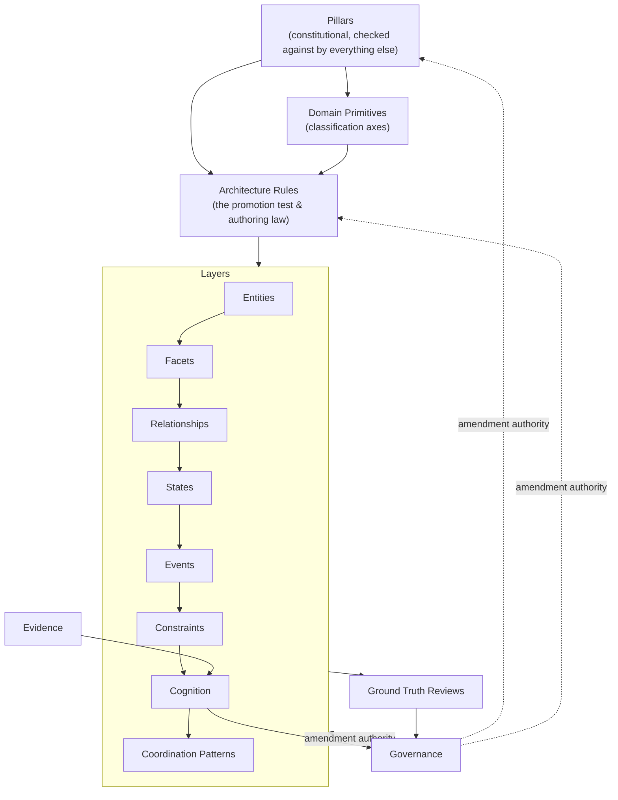

# ONTOLOGY DESIGN — BLUEPRINT

**Type:** Discovery & authoring blueprint (not the Ontology Design document itself)
**Governs the future authoring of:** `docs/01-methodology/ONTOLOGY_DESIGN.md`
**Does not contain:** any ontology class, entity, relationship, taxonomy value, or engineering artifact. This document defines the *shape* the ontology design must take and the *decisions* that must be made before any concept is modeled — it does not model a single concept itself.
**Client instruction governing this document:** the client has directed that ontology *design* precede ontology *architecture* and ontology *engineering*. This blueprint is the first artifact of that design phase. All prior repository structure, domains, taxonomies, schemas, and implementation are explicitly out of scope and have not been consulted in producing it — this is a first-principles restart, built only on the frozen Vision, Business Master Plan, and Humanitarian Business Reference Model.

---

## 1. Purpose

### Why this document exists

The Humanitarian Business Reference Model (HBRM) gives Khidmat AI a deduplicated, citable catalog of business concepts — Person, Household, Need, Verification, Referral, and roughly a hundred others — each defined once, in business language, with no ontological shape. That catalog is necessary but not sufficient. It answers *what exists as a business idea*. It does not answer *how that idea should be formally represented* — whether "Household" is a thing with identity that persists through time, or a role a Person plays, or a bundle of qualities attached to something else; whether "Verification" is an event, a state, or a relationship; whether a claim a volunteer makes about a family's circumstances is the same kind of thing as a fact the system is willing to act on.

Answering that second question well, and consistently, across every one of those hundred-plus concepts, is what an ontology *design* is for. Get it wrong and the project inherits the single most expensive failure mode in ontology engineering: concepts modeled inconsistently by whoever happened to be authoring that week, discovered only once enough of them exist to collide.

This blueprint exists to prevent that failure by designing the *design* first: before a single Entity or Relationship is authored, this document fixes what kinds of thing the ontology is allowed to contain, what test decides which kind a candidate concept belongs to, what non-negotiable principles every concept must satisfy, and who has the authority to change any of it later. Once approved, this becomes the constitution the Ontology Design document is authored against — the same relationship the Business Master Plan Blueprint had to the Business Master Plan itself.

### What question it must answer

Not "what does Khidmat's ontology contain" (that is Ontology Design's job) and not "how is it encoded, stored, or queried" (that is Ontology Engineering's, further downstream still). This document answers one question: **given the humanitarian business reality the BMP and HBRM already establish, what is the smallest, most defensible set of structural categories and design rules needed to represent that reality formally, consistently, and honestly about its own uncertainty?**

### What this document is not

- It is not the ontology. No entity, class, property, or taxonomy value appears in it.
- It is not a re-derivation of the humanitarian business reality already frozen in the BMP and HBRM. Where this document needs an example, it draws one from those documents by citation; it does not restate or reinterpret their content.
- It is not a software or engineering architecture document. Storage, query language, graph technology, and API shape are explicitly out of scope, exactly as they were out of scope for the BMP and the HBRM at their own altitudes.
- It is not a finished decision. Several of the sections below present more than one defensible interpretation and recommend one — the client's role is to ratify, amend, or override that recommendation, not to receive it as already settled.

---

## 2. Scope

### What belongs in the Ontology Design document (once authored)

Per the client's required structure, seven top-level sections: Domain Primitives; Layers (Facets, Entities, Relationships, Constraints, States, Events, Cognition, Coordination Patterns); Pillars; Architecture Rules; Ground Truth Reviews; Evidence; Governance. Each is designed — purpose, contents, connections, and required decisions — in Section 5 below.

### What does not belong

- Any concept already the exclusive property of a downstream document. Ontology Design decides *shape*; it must not silently make a Business Architecture decision (who holds an authority boundary), a Domain Discovery decision (whether a new humanitarian domain is genuinely novel), or an engineering decision (schema, storage, encoding).
- Anything that only makes sense with reference to a specific technology, file format, or prior repository artifact. The same litmus test the BMP used applies here, restated one layer up: **could this statement be true of *any* competently designed humanitarian ontology, independent of Khidmat's specific implementation?** If yes, it belongs here. If it only makes sense because of a specific engineering choice already made, it belongs later.
- A restatement of BMP or HBRM content. This document formalizes *how to formalize*, not the business reality itself.

### The altitude this document sits at

Business Master Plan → Humanitarian Business Reference Model → **Ontology Design (this blueprint governs its authoring)** → Ontology Architecture → Ontology Engineering.

The BMP described reality in narrative. The HBRM catalogued that reality's stable concepts. Ontology Design decides what *kind of formal object* each catalogued concept becomes, and what design law governs that decision consistently across all of them. Ontology Architecture (a distinct, later document) will decide how the resulting design is technically realized. Ontology Engineering will author it. Nothing later in this chain is permitted to redefine a decision this document settles; nothing here is permitted to make a decision that belongs later.

---

## 3. Audience

- **Primary:** the client, as the approving authority for the structural and philosophical commitments below — several of which are genuine forks in the road, not implementation detail, and are flagged for explicit client decision rather than silently resolved.
- **Secondary:** the future author of `ONTOLOGY_DESIGN.md`, who needs this blueprint the same way the BMP's author needed the BMP Blueprint — a governing structure, not a first draft.
- **Tertiary:** future Ontology Architecture and Ontology Engineering authors, for whom every decision recorded here becomes a constraint they inherit rather than a question they get to reopen.

---

## 4. Foundational Design Stance

Before designing the seven sections individually, one governing idea has to be stated plainly, because it shapes every section that follows: **this ontology is being asked to represent not only humanitarian reality, but the system's own uncertainty about that reality.**

The Vision's mandate — Knowledge → Understanding → Reasoning → Automation, with automation permitted only once understanding is genuinely established — is not satisfiable by an ontology that only models *what is true*. A schema of "Household," "Need," and "Assistance" alone would be a perfectly ordinary humanitarian data model. What makes this an ontology built for a system that is required to *understand before it acts* is that it must also model: what is merely *claimed* versus *verified*; how confident the system is entitled to be; where a human must be the one to decide; and how a universal business rule differs from a locally-variable one. This is why the client's required structure includes sections a conventional ontology design would not — Cognition, Ground Truth Reviews, Evidence, and (arguably) Coordination Patterns are exactly the sections that exist because Khidmat's founding constraint is epistemic humility, not merely domain coverage.

Concretely, this stance implies a dependency order across the seven sections that is not identical to the order they were listed in, and Section 6 makes that dependency graph explicit. It also implies a recurring test that should be applied at every layer below: **a candidate concept is not ready to be modeled until it is clear not only what it *is*, but how confident the system is ever entitled to be about it, and who is entitled to override that confidence.** This test recurs throughout Section 5 and is formalized once, centrally, rather than reinvented per layer — see §5.4 (Architecture Rules) and §5.6 (Evidence).

---

## 5. Section-by-Section Design

### 5.1 Domain Primitives

**Purpose.** Domain Primitives are the smallest, closed set of foundational categories that every later concept — every Entity, Facet, Relationship, Constraint, State, Event, Cognition-construct, and Coordination Pattern — must be classifiable under. They are not concepts themselves in the HBRM sense; they are the *axes of classification* that make the rest of the design decidable rather than ad hoc.

**Why this section exists.** Without an agreed, closed set of primitives fixed before any concept is modeled, every future author faces the same question in isolation — "is this a kind of Actor, a kind of Need, a kind of Resource?" — and different authors, at different times, will answer it differently. That drift is invisible while the ontology is small and becomes expensive exactly at the scale where it is hardest to fix. Fixing the primitives first is the ontology-design equivalent of the HBRM's own discipline of extracting Chapter 0's cross-cutting concepts before drafting any other chapter — except one level more abstract: HBRM Chapter 0 catalogued cross-cutting *business concepts* (Person, Household, Need); Domain Primitives must catalogue the cross-cutting *categories of concept* that even Person, Household, and Need are instances of.

**A genuine design fork, requiring client decision.**

- *Interpretation A — Primitives as meta-categories.* Domain Primitives is a small (five-to-nine item), abstract, closed list of foundational kinds of thing — for example, something like: *a party capable of acting or being acted upon* (covers Person, Household, Organization); *a gap between circumstance and wellbeing* (covers Need); *a capacity or means brought to bear* (covers Resource, Capability); *a response* (covers Assistance); *a asserted piece of reality* (covers Claim/Evidence); *a point or span in time*; *a location or context*. Every HBRM concept is then classified against this list, not duplicated by it.
- *Interpretation B — Primitives as the HBRM's own Chapter 0 concepts, promoted directly.* Domain Primitives simply *is* Person, Household, Need, Community, Assistance, and Capacity to Cope, carried forward unchanged as the ontology's foundation layer.

**Recommendation: Interpretation A**, for a specific reason grounded in the project's own prior discipline: HBRM Chapter 0 already exists, is already frozen, and already serves as the canonical home for those specific cross-cutting business nouns — re-declaring them verbatim as "Domain Primitives" would duplicate an already-solved problem rather than solve a new one. What is genuinely still missing is the more abstract classification layer that would let a future author correctly answer, for a concept the HBRM has not yet catalogued at all (because a new humanitarian domain has not yet activated), which kind of ontological citizen it should become. Interpretation A gives that answer; Interpretation B does not, because Person and Household are not, themselves, categories that a novel future concept could be tested against — they are already fully specific. Under this recommendation, HBRM Chapter 0's concepts become the *first instances classified against* the primitives, not the primitives themselves.

**Design decisions required before this section is complete.**
1. The closed list of primitives itself — how many, and named how. (This blueprint deliberately does not propose the final list; that is Ontology Design's job, informed by this recommendation.)
2. Whether the list is genuinely closed (no thirteenth-hour addition once modeling begins) or extensible under a defined, high-governance-tier procedure — this is the same tension the BMP's own Chapter 9 named between universal and variable, one layer up: are Domain Primitives themselves universal, or could a future humanitarian context reveal one this design missed?
3. Whether a concept may belong to more than one primitive simultaneously (e.g., is a Volunteer classified purely as "a party capable of acting," or does their community-standing also implicate a second primitive) — this bears directly on how multiple inheritance is handled in every later layer.

**Connections.** Domain Primitives is the first gate every candidate concept must pass before entering any Layer (§5.2). It is also the shared vocabulary the Architecture Rules' promotion test (§5.4) is written in terms of, and the anchor the Ground Truth Review process (§5.5) checks against when validating that reality still fits the categories assumed at design time.

---

### 5.2 Layers

**Why "Layers," plural, as a container.** The client's structure groups eight distinct kinds of ontological content — Facets, Entities, Relationships, Constraints, States, Events, Cognition, Coordination Patterns — under one heading. That grouping is doing real work: it signals that these eight are peers in one sense (each is a *kind of thing an ontology concept can be*) while remaining structurally distinct from Domain Primitives (the classification axes above them), Pillars (the values that bind them), and Architecture Rules (the law governing how they are authored). Layers is where the actual modeling happens; everything else in this document exists to make that modeling disciplined rather than ad hoc.

**A design decision that must be resolved before the eight sub-layers are authored: dependency order.** The client's listed order (Facets, Entities, Relationships, Constraints, States, Events, Cognition, Coordination Patterns) is a reasonable *presentation* order but is unlikely to be the correct *authoring* order, because several later-listed layers structurally presuppose earlier-listed ones being already defined for a given concept. The recommended authoring dependency, reasoned below layer by layer, is:

**Entities → Facets → Relationships → States → Events → Constraints → Cognition → Coordination Patterns.**

The reasoning for each is given inline below. This reordering should be treated as a Required Change to confirm before authoring begins, not a settled fact — flagged explicitly in §7.

#### 5.2.1 Entities

**Purpose.** The things with independent identity that persist through time and that the rest of the ontology is *about* — a specific Person, a specific Household, a specific Case, a specific Organization, a specific Intervention. An Entity is re-identifiable: the same Household referred to in two different conversations, six months apart, must resolve to the same Entity, not a fresh one.

**Why it must be authored before Facets, not after.** A Facet (below) is a dimension *of* something; it cannot be designed in the abstract without first knowing what kinds of thing it attaches to. This is the primary reason to reorder the client's list for authoring purposes, while preserving it for presentation.

**What it must contain.** For each Entity type: what makes two instances the same Entity versus two different ones (identity criteria); what its minimal, always-true nature is (independent of any Facet that may or may not be attached); which Domain Primitive(s) it is classified under.

**Design decisions required.** Whether Entities are limited to the "obviously standalone" business nouns (Person, Household, Organization, Case) or extend further (is a single Need its own Entity, re-identifiable and trackable over time, or is it better modeled as a Relationship or a State attached to a Household — see the promotion-test discussion in §5.4). This single question is likely the highest-leverage decision in the entire Layers section, because it determines how many other candidate concepts default to Entity status versus something lighter-weight.

**Connections.** Every Facet, Relationship, State, and Event in this section ultimately attaches to, connects, or happens to one or more Entities. Entities are what Coordination Patterns (§5.2.8) are patterns *of*.

#### 5.2.2 Facets

**Purpose.** Composable, independently-varying dimensions or aspects of an Entity — vulnerability, capacity to cope, consent status, cultural or religious context, trust standing — that qualify an Entity without being separate things with their own identity, and without forcing a new Entity subtype every time a new dimension of someone's situation is recognized.

**Why this layer exists, specifically.** The Vision insists that "every individual has a story... every need has context," and the BMP repeatedly shows a single Household carrying several simultaneous, independently-varying dimensions (multiple needs, differing vulnerabilities across members, a capacity to cope that is present-tense and separate from any single need). Without a Facet layer, the only available response to that richness is to keep minting new Entity subtypes ("Vulnerable Household," "High-Trust Household," "Consented Household") — a pattern that multiplies uncontrollably and produces exactly the kind of entity explosion a well-designed ontology exists to prevent. Facets exist to let an Entity's situation be described in layers that can be added, removed, or revised independently, without redefining what the Entity fundamentally is.

**A design fork requiring a decision.** Should a Facet be a *static attribute* (a value on the Entity, true until overwritten) or a *first-class, evidence-backed assertion* (a dimension that itself carries a confidence score, a source, and an as-of date, independent of the Entity's own record)? Given Khidmat's insistence that verification precede trust, and that the system must be able to express "we believe this household's capacity to cope is currently low, with moderate confidence, based on a volunteer visit three weeks ago" rather than a bare unqualified flag — **the recommendation is the latter**: Facets should be modeled as evidence-backed, time-stamped assertions, not bare attributes. This is the same design commitment that will later connect this layer directly to Evidence (§5.6) and Cognition (§5.2.7); a Facet that could not carry its own confidence and provenance would silently reintroduce exactly the false certainty the Vision names as the thing Khidmat exists to avoid.

**Design decisions required.** Whether every Facet must be evidence-backed, or whether some Facets (e.g., a self-declared preference) are legitimately unverified by design and must be modeled as such rather than smuggled in as equal-confidence to a verified one; how a Facet's own lifecycle (added, revised, expired, superseded) is distinguished from the Entity's lifecycle it attaches to; whether Facets can attach to Relationships as well as Entities (e.g., is "trust" a Facet of a Household, of a Volunteer, or of the *relationship between* them — this has a real answer and it likely varies by case, which argues for allowing Facets on Relationships too, not only Entities).

**Connections.** Facets depend on Entities (or Relationships) existing first. They are the primary consumer of the Evidence layer (§5.6) and the primary object the Cognition layer (§5.2.7) reasons about when estimating confidence.

#### 5.2.3 Relationships

**Purpose.** Connections between two or more Entities (and, per the decision above, potentially bearing their own Facets) — Household HAS_MEMBER Person, Organization DELIVERS Assistance TO Household, Volunteer REFERS Case TO Organization, Community Structure MEDIATES_TRUST_FOR Household.

**Why it must be authored after Entities and Facets, not before.** A Relationship is meaningless without the Entities it connects already being defined, and — per §5.2.2's recommendation — a Relationship may itself need to carry confidence/evidence exactly as a Facet does (a *claimed* family relationship versus a *verified* one is not a cosmetic distinction; BMP Chapter 1 explicitly treats intermediaries speaking on a household's behalf as a distinct, sometimes-unverified business reality).

**What it must contain.** For each Relationship type: which Entity types it connects and in what direction (or whether it is symmetric); its own temporal validity (relationships start and end — a Volunteer's affiliation with an Organization is not eternal); its cardinality (can a Household have more than one concurrent Referral relationship — the BMP already states, as a business rule, that a household may have more than one concurrent need, which strongly implies more than one concurrent Assistance relationship is a real, expected configuration, not an edge case).

**Design decisions required.** Whether Relationships are first-class enough to carry their own Facets and evidence (recommended, per §5.2.2's reasoning) or are treated as bare structural links with any qualifying detail pushed onto the Entities at either end; how a Relationship's own claim-versus-verified status is represented consistently with how a Facet's is.

**Connections.** Depends on Entities. Frequently the subject of Constraints (§5.2.4 — cardinality rules are usually rules *about* relationships) and the building block Coordination Patterns (§5.2.8) assemble into recognizable multi-actor shapes.

#### 5.2.4 Constraints

**Purpose.** Rules that bound which configurations of Entities, Facets, Relationships, States, and Events are valid — cardinality-like facts already named in business language by the BMP and HBRM (e.g., "a household may have more than one concurrent need") and, separately, the governance/authority-boundary facts named in BMP Chapter 8 (e.g., which category of decision a case-level actor is entitled to make versus one requiring escalation), and the universal-versus-variable discipline named in BMP Chapter 9.

**Why this layer must come after Entities, Facets, and Relationships, not before.** A Constraint restricts something; it cannot be authored meaningfully until the thing it restricts already has a shape. This is also why Constraints is the layer where the BMP Chapter 9 universal/variable discipline finds its ontological home: a Constraint should be explicitly tagged as universal (holds in every deployment context) or variable (holds only in some, with the specific variation named), rather than left implicit — this is the direct, one-layer-up continuation of a discipline the BMP already established in prose and the HBRM already catalogued but did not yet have anywhere to formally attach.

**Design decisions required.** Whether ethical/authority constraints (who may decide what) live in this layer at all, or whether they belong more properly to Pillars (§5.3) as non-negotiable design law rather than as a per-concept business rule — this is a real boundary question, addressed directly in §5.3's own design-decision list, and the two sections must agree on where the line falls before either is considered complete. The recommendation given there is: Pillars hold the *unconditional* rules (never overridable by any context); Constraints hold the *conditional, business-rule-shaped* ones (cardinality, and authority boundaries that are real but were already explicitly left un-ranked and un-resolved by the BMP itself and must not be silently resolved here either).

**Connections.** Depends on Entities, Facets, Relationships already being defined. Directly implements the universal/variable discipline that Ground Truth Reviews (§5.5) later tests against real contexts.

#### 5.2.5 States

**Purpose.** The enumerable condition an Entity (most often a Case, a Need, or an Assistance instance) occupies at a point in time — the *stopping points* the BMP's Chapter 3 lifecycle names (need exists unseen, known, engaged, understood, decided, planned, mobilized, delivered, observed, reassessed, closed/continued), catalogued as concepts, without reproducing the flow between them.

**Why it must be authored before Events, not after.** An Event (below) is most naturally defined as *what causes a transition from one State to another*; States must exist first for that definition to be meaningful.

**A design decision with real consequences.** Should a State be a simple label on an Entity (an enum value, true until changed), or — consistent with the recommendation already made for Facets — a first-class, evidence-backed, time-stamped assertion ("we believe this Case is in the Delivery state, as of this date, based on this report, with this confidence")? **Recommended: the latter, for the same reason as Facets.** The project's own philosophy requires the system to be able to express uncertainty about its own tracking of reality, not only about the reality itself — "we believe this case has moved to Recovery" is a materially different, more honest claim than a bare status flag, and it is the only version of this idea that supports a human reviewer meaningfully challenging or correcting the system's state-tracking rather than simply overwriting it.

**Design decisions required.** Whether more than one State can be simultaneously true for different needs within one Household (the BMP explicitly allows this — "a household can have more than one need at a time, each at a different stage... simultaneously") which argues that States must attach to the *Need-within-a-Case* granularity, not the Household as a whole; how a State's evidence requirement interacts with the Constraint layer's cardinality rules (can a Case be simultaneously "closed" for one need and "in delivery" for another).

**Connections.** Depends on Entities. Is the direct formalization of BMP Chapter 3's lifecycle stopping-points and HBRM Chapter 3's lifecycle concepts. Feeds directly into Coordination Patterns (§5.2.8), which are recognizable sequences of State change across multiple Entities.

#### 5.2.6 Events

**Purpose.** Occurrences in time that cause, or are otherwise relevant to, a State transition — a need becomes known, a verification visit occurs, a resource is delivered, a household reports a change, a reassessment is triggered.

**Why it belongs after States.** An Event's defining feature is what it *does* to a State (or what State it is evidence for); designing Events before States would leave "cause a transition" undefined.

**What it must contain.** For each Event type: what State transition(s) it can trigger or evidence; what Entity or Relationship it is an occurrence *of* or *about*; whether it is itself evidence-bearing (most Events plausibly are — an Event is frequently the very thing recorded as the Evidence behind a Facet or State assertion, which argues for a tight, explicit connection between this layer and §5.6 rather than treating them as unrelated).

**Design decisions required.** Whether Events are retained permanently as an immutable history (recommended, given the project's evidentiary and accountability commitments — BMP Chapter 4's Accountability and Reporting capability and Chapter 7's Effective Stewardship objective both depend on an honest, non-revisable account of what actually happened) or whether some Event types are transient and need not be retained once their effect on a State is recorded; how an Event that later turns out to be based on a false claim is handled — is the Event record itself corrected, retracted, or left standing with a superseding correction event layered on top (the latter is more consistent with an immutable-history design and is recommended).

**Connections.** Depends on States existing. A primary source for the Evidence layer (§5.6). The raw material Coordination Patterns (§5.2.8) recognize repeating sequences within.

#### 5.2.7 Cognition

**Purpose.** The ontological representation of the system's own epistemic state about everything modeled above — not a new business fact, but a layer describing what the system currently believes, how confident it is entitled to be, what is claimed versus verified, what inference produced a given belief, and where a confidence threshold requires the system to stop and escalate to a human rather than act.

**Why this layer must exist at all — a question worth stating and answering directly, not assuming.** A reasonable objection: isn't "confidence scoring" and "inference provenance" a reasoning-*engine* concern, implemented in software, rather than something that belongs in an *ontology*? The recommended answer is no, and the reasoning matters: the Vision's central, non-negotiable constraint is that automation may never proceed past a stated point without adequate understanding — that constraint is not enforceable as a design principle unless the ontology itself can *represent* a claim's confidence, source, and verification status as first-class facts, queryable and auditable independent of whatever specific reasoning engine happens to compute them. If confidence and claim-status live only inside application code, the ontology cannot express "this Household's stated Need has not yet reached the confidence required for autonomous action" as a fact about the world it models — and the project's founding sequence (Knowledge → Understanding → Reasoning → Automation) becomes an implementation convention rather than a structural guarantee. Cognition exists to make that guarantee structural.

**Why it must come after Evidence conceptually, even though authored here.** Cognition is what Evidence (§5.6) is *for* — Evidence is the raw material (what was observed, submitted, or verified); Cognition is the resulting belief state built from it (confidence, claim-versus-fact status, inference chain). This boundary is significant enough that it is treated as its own explicit design decision in §5.6, not assumed here.

**What it must contain.** A representation of a Claim (an assertion not yet, or not fully, verified) as distinct from a Fact (a verified assertion the system may rely on with stated confidence); a confidence/uncertainty representation attachable to any Facet, Relationship, or State assertion; an explicit representation of an escalation threshold — the point at which the ontology itself records that a human decision is required, rather than this being purely an application-level rule.

**Design decisions required.** Whether Cognition is a layer that *wraps* other layers (every Facet/State/Relationship assertion optionally carries a Cognition-layer confidence wrapper) or a separate parallel structure that references them (a standalone Claim entity pointing at what it is a claim about) — this is a real architectural fork with different consequences for how uniformly confidence gets applied, and is flagged for explicit resolution before Ontology Architecture begins, not silently defaulted; how confidence is represented (a numeric score, a qualitative tier, or both) and whether that representation itself needs to vary by context (a decision that would make confidence-representation subject to the same universal/variable discipline as Constraints).

**Connections.** Consumes Evidence (§5.6). Wraps or references Facets, Relationships, and States. Is the mechanism by which the Understanding-Before-Automation Pillar (§5.3) becomes checkable rather than aspirational.

#### 5.2.8 Coordination Patterns

**Purpose.** Recurring, recognized multi-Entity configurations — a Referral pattern (Case handed from one Organization to another, carrying forward accumulated understanding rather than starting over), a Multi-Organization Response pattern (many Organizations, one Community, shared visibility), an Escalation pattern (a case-level Cognition-layer confidence gap triggers a specific authority-boundary response) — modeled as the ontological formalization of BMP Chapter 5's Value Streams, one layer more formal, but explicitly not an executable workflow.

**A boundary that must be actively policed.** This is the layer most at risk of quietly becoming a process/workflow specification, which the project's own established discipline (business-purity, no premature automation) forbids at this altitude. The recommended discipline: a Coordination Pattern describes a recognizable *shape* — which Entities, Relationships, States, and Events recur together, in what order, and what the pattern's Constraints and required Cognition-confidence thresholds are — without specifying *how* a system should execute or automate it. Whether a given Coordination Pattern is ever actually automated, and under what governance, is an Automation-layer decision made far downstream of this document, gated by the very Cognition-layer confidence machinery this section formalizes.

**Why it is listed last, and correctly so, in both the client's order and the recommended authoring order.** A Coordination Pattern is a composition of everything above it — Entities, Facets, Relationships, States, Events, Constraints, and Cognition all have to exist before a recurring configuration of them can be named. This is the one layer where the client's given order and the recommended authoring order agree.

**Design decisions required.** Whether a Coordination Pattern is itself a first-class, citable concept (recommended — BMP Chapter 5 already treats its five value streams as independently named and reasoned-about, not merely inferred) or purely descriptive documentation with no formal ontological status; how a Coordination Pattern's own Cognition-confidence requirement is expressed (does the Referral pattern require a stated minimum confidence in the receiving Organization's understanding before it is considered complete, and if so, is that requirement itself a Constraint, a Pillar-level rule, or intrinsic to the pattern's own definition).

**Connections.** Depends on every other Layer. Is the ontological analogue of BMP Chapter 5's Value Streams and the eventual home for whatever Business Architecture later decides about cross-organization coordination authority (BMP Chapter 8, §8.6).

---

### 5.3 Pillars

**Purpose.** The small number of non-negotiable, unconditional design commitments that every Domain Primitive, Layer instance, Constraint, and Coordination Pattern must satisfy — the ontology's own constitution, distinct from any single concept's own business rule.

**Why this section must exist as its own thing, separate from Constraints.** A genuine, easily-missed boundary question: are "human dignity must be preserved" and "verification must precede trust" business rules (Constraints, §5.2.4) or something categorically stronger? The recommendation is that they are categorically stronger, and deserve their own section, for a specific reason: a Constraint, per §5.2.4's own design, can legitimately be *variable* — true in one context, different in another, per the BMP's own Chapter 9 discipline. A Pillar must never be variable by design; it is exactly the set of things the BMP Chapter 9 test would classify as universal in the strongest sense — removing it wouldn't just change the model's *form*, it would mean the system was no longer the system the Vision describes. Collapsing Pillars into ordinary Constraints risks exactly the failure mode where a future context-specific override (legitimately applied to a Constraint) accidentally weakens something that was never supposed to be overridable at all.

**A genuine fork requiring client decision: what is a Pillar, structurally?**

- *Interpretation A — Pillars as principle-based design law.* A short (five-to-seven item), constitutional list of design commitments derived directly from the Vision and the project's stated philosophy — for example, in substance though not yet in final wording: Human Dignity and Agency (no Entity or Facet representation may reduce a Person to a processed case, echoing BMP Ch.2 §2.1 and Ch.7 §7.2); Verification Before Trust (no Cognition-layer Fact status without traceable Evidence); Understanding Before Automation (no Coordination Pattern may be automated below a stated Cognition confidence threshold); Distributed, Non-Centralized Authority (mirroring BMP Ch.8's finding that different decisions require different, non-transferable knowledge); Universal-Variable Honesty (every Constraint must be explicitly tagged, never silently assumed universal). Every candidate concept in every Layer is checked against this list before acceptance — the ontology-design-layer equivalent of the BMP's own litmus test.
- *Interpretation B — Pillars as top-level structural domains.* A set of major bounded groupings the ontology organizes around (e.g., "Human & Household," "Need & Vulnerability," "Assistance & Intervention," "Trust & Evidence," "Coordination & Governance"), functioning as a navigational skeleton for how concepts within the Layers are grouped.

**Recommendation: Interpretation A.** Interpretation B would duplicate work the Domain Primitives (§5.1) and the HBRM's existing ten-chapter structure already do reasonably well as organizing devices; it adds a second, competing organizational scheme without adding new design value. Interpretation A, by contrast, gives the ontology something no other section currently supplies: an enforceable, testable statement of the values every layer must be checked against — turning the Vision's prose ("human dignity must always remain at the center of every decision") into a standing, citable rule a future reviewer can check any given Entity, Facet, or Coordination Pattern against, the same way the BMP's own tensions and objectives were checkable rather than aspirational once written down.

**Design decisions required.** The final, closed wording of each Pillar (deliberately not proposed here — that is Ontology Design's job once this recommendation is ratified); whether Pillars require the highest governance tier to amend (recommended — see §5.7) given they are meant to be the one part of this design that ordinary iteration should not be able to erode; how a proposed Layer concept that appears to violate a Pillar is handled procedurally (rejected outright, or flagged and escalated — recommended: escalated, consistent with the project's own "flag, don't guess" discipline rather than a silent rejection with no record).

**Connections.** Every other section is checked against Pillars, not the reverse. Pillars bind Domain Primitives (§5.1), every Layer (§5.2), Constraints specifically (as the boundary discussed in §5.2.4), and set the non-negotiable floor Ground Truth Reviews (§5.5) must confirm the model still honors.

---

### 5.4 Architecture Rules

**Purpose.** The authoring discipline governing how Layers themselves get built and kept consistent over time — not what the ontology says about humanitarian reality, but the law governing how anyone is permitted to add to or change what it says.

**Why this section exists.** Every design decision flagged in §5.2 as "recommended, but requires confirmation" needs somewhere to live once confirmed, in a form future authors are bound by rather than free to re-litigate concept by concept. Architecture Rules is that home. Its single most important job is a decision procedure this document has repeatedly deferred to it by name: **the promotion test** — given a candidate concept, how does an author decide whether it becomes an Entity, a Facet, a Relationship, a Constraint, a State, or nothing at all (folded into an existing concept)? Without a named, repeatable test, this decision will be made by instinct, inconsistently, exactly the failure this whole document exists to prevent.

**What it must contain.** The promotion test itself (a small, ordered set of questions — does the candidate have independent identity and persist through time? if not, does it vary independently of the thing it qualifies? if not, is it a connection between two already-established things? — applied in a fixed order so two different authors reach the same classification for the same candidate); a global concept-identity and uniqueness rule (every concept, across every Layer, has exactly one canonical name and identifier — the ontology-layer continuation of the same single-ownership discipline the HBRM already applied one level down); a change-control rule (an already-published concept's identifier is never silently reused or redefined; amendment, deprecation, and splitting each have a defined, recorded procedure); the mechanism by which a Constraint or Facet is tagged universal versus variable, and how a variable one records its specific variation without inventing a new concept for every region (the ontological continuation of BMP Chapter 9's discipline).

**Design decisions required.** Where exactly the promotion test's decision boundary falls between Entity and Facet — this is likely to be the single most contested classification in practice (is "Need" an Entity or a Facet of a Household?) and deserves the test to be pressure-tested against several real HBRM concepts before being considered final, not accepted on first draft; whether Architecture Rules itself is amendable at the same governance tier as an ordinary concept, or requires the same elevated tier as Pillars (recommended: elevated, though one tier below Pillars themselves, since the promotion test shapes every future decision the way Pillars shape every future value judgment).

**Connections.** Directly operationalizes the recommendations flagged throughout §5.2 as "requires confirmation." Is checked against Pillars (§5.3) for every rule it establishes. Is the register Ground Truth Reviews (§5.5) and Governance (§5.7) both cite when a proposed change needs to be evaluated for consistency.

---

### 5.5 Ground Truth Reviews

**Purpose.** The recurring, formal discipline of checking whether the ontology's model of reality — its Primitives, its Layer concepts, its universal-versus-variable Constraint tags — still actually matches lived humanitarian practice, in specific, real contexts, on an ongoing basis rather than only at initial design time.

**Why this section must exist, and why it is dangerous to treat as a one-time gate.** The Business Master Plan's own Chapter 9 explicitly flagged, as an open item, that its universal-versus-variable discipline "has never been tested against a real, specific regional case" — a gap the project's own governance process rated as high priority precisely because an untested universal claim is a liability wearing the appearance of settled fact. An ontology built on that same discipline inherits the identical risk, at a more consequential layer: a Constraint or Pillar wrongly assumed universal, once encoded structurally, is far more expensive to discover and correct than a paragraph of prose making the same mistake. Ground Truth Reviews exists to make that discovery routine and expected rather than accidental.

**A design fork requiring a decision: who conducts a Ground Truth Review, and does that list include the people the ontology is ultimately about?** The project's own inherited principle of "bidirectional accountability and beneficiary voice" argues for a real answer here, not a default one: a Ground Truth Review conducted only by domain experts and field staff would validate whether the model matches *organizational* practice, but not necessarily whether it matches how a Person or Household actually experiences and would describe their own situation — and the Vision's own definition of success is stated entirely in terms of the latter. **Recommended:** Ground Truth Reviews should be a two-part discipline — expert/field validation (does this match how implementing organizations and volunteers actually operate) and, wherever feasible given consent and context, direct validation with the people the ontology models (does this match how a household would describe its own reality) — treated as two distinct, both-required checks rather than one review satisfying both concerns by default.

**What it must contain.** A defined cadence (not solely a pre-launch gate — a recurring schedule, plus explicit out-of-cycle triggers such as activating a new region or humanitarian domain); a defined disposition procedure for a failed review (what happens when a Constraint assumed universal turns out not to hold in a real context — does it become explicitly variable, get corrected at the Primitive level, or trigger an escalation to Governance); a record of what has been tested against what, so that an untested assumption remains visibly untested rather than silently assumed validated once the ontology has existed for a while.

**Design decisions required.** How "ground truth" itself is established when field evidence conflicts with the existing model — this is not a hypothetical; it is the direct, expected consequence of taking the universal-variable discipline seriously, and needs a decided answer (recommended: the field evidence wins, and the model is corrected, never the reverse — reality is not obligated to conform to a prior design); how findings from this section feed into Governance (§5.7) versus being resolved locally.

**Connections.** Tests Domain Primitives (§5.1) and the universal/variable tagging in Constraints (§5.2.4) against real contexts. Findings escalate into Governance (§5.7). Is itself a Pillar-adjacent commitment (an ontology that never checks itself against reality would itself be a violation of Understanding Before Automation, applied reflexively to the ontology's own claims).

---

### 5.6 Evidence

**Purpose.** The record of what was actually observed, submitted, reported, or verified, and by what means — documents, verification visits, witness or volunteer testimony, cross-referenced claims from more than one source — and how that record attaches to any Facet, Relationship, State, or Event assertion made elsewhere in the ontology.

**Why this section exists, separately from Cognition.** This is the boundary flagged as needing explicit resolution back in §5.2.7, and it deserves to be settled here rather than left ambiguous, because it is exactly the kind of two-terms-for-one-idea risk the HBRM's own authoring process encountered once already (and correctly did not resolve by assumption) with "resilience" versus "capacity to cope." **Recommendation: Evidence and Cognition are related but distinct, in a Broader/Narrower shape, not synonyms and not the same layer under two names.** Evidence is the *input* — the raw material of what was observed or submitted, with its own provenance and chain of custody. Cognition (§5.2.7) is the *derived belief* — the confidence, claim-versus-fact status, and inference the system forms *from* that Evidence. Evidence can exist without yet having produced a confident Cognition-layer belief (a single, uncorroborated report is Evidence the moment it is recorded, long before it earns Fact status); Cognition cannot exist without Evidence behind it. Treating them as one layer would obscure exactly the distinction the project's philosophy most needs preserved: the difference between *what was said* and *what the system is entitled to believe*.

**What it must contain.** A typology of evidence sources (self-report, third-party report, physical/documentary evidence, direct observation, cross-referenced corroboration) with their own inherent reliability characteristics, modeled honestly rather than assumed equal; a provenance/chain-of-custody representation (who submitted this, when, under what circumstances); an evidence lifecycle (can evidence expire, be contested, be superseded, or retracted, and what happens to a Cognition-layer belief that was built on evidence later retracted — recommended: the belief is not silently deleted but explicitly superseded, preserving an honest history, consistent with the immutable-history recommendation made for Events in §5.2.6).

**Design decisions required.** Whether Evidence quality/reliability is itself represented structurally (a typed hierarchy of source reliability) or left entirely to the Cognition layer's confidence computation to absorb — recommended: represented structurally at the Evidence layer, because the *type* of evidence (a documentary record versus an unverified self-report) is a fact about the world independent of any particular confidence calculation a reasoning process might later perform on it, and collapsing the two would make it impossible to audit *why* a given confidence was assigned; how consent (a Person's or Household's agency over what evidence about them exists and who may see it) is represented — this is a real gap the project's own governance trail has already flagged as a named, currently-unfilled business concept, and this section is where its ontological representation would need to live once that business-level concept is formally established upstream.

**Connections.** Feeds Cognition (§5.2.7) directly. Is what Facets, Relationships, and States (§5.2.2–§5.2.5) cite when they carry a confidence/provenance wrapper. Is what Ground Truth Reviews (§5.5) treat as the authoritative material when checking a model claim against reality.

---

### 5.7 Governance

**Purpose.** Who has the authority to propose, review, approve, amend, deprecate, or freeze any concept in any of the sections above, and at what tier of scrutiny, given that some changes (a new Facet type) are routine and others (amending a Pillar) are close to constitutional.

**Why this section's structure should not be invented from scratch.** The Business Master Plan's own Chapter 8 already worked out, at the business level, why authority over different kinds of decision must be distributed rather than centralized — case-level decisions need situated knowledge no higher level has; program-level decisions need cross-case pattern knowledge no single case-level actor has; strategic decisions need a long-horizon view that would be crowded out by daily operational demands. **Recommendation:** ontology governance should mirror this same distributed-authority logic, one layer up, rather than invent an unrelated scheme: a new Facet or State value within an already-established Entity type is analogous to a case-level decision (narrow, frequent, low blast-radius, decidable by whoever is closest to the concept); adding a new Entity type or Coordination Pattern is analogous to a program-level decision (broader pattern knowledge required, less frequent); amending a Domain Primitive, an Architecture Rule, or — highest of all — a Pillar is analogous to a strategic/policy-level decision (rare, high blast-radius, requiring the broadest view of the whole design's coherence). This is not a forced analogy; it is the same underlying reason the BMP gave for why authority is distributed at all — different decisions require different, non-transferable knowledge — applied to a different kind of decision.

**What it must contain.** The tiering above, made concrete with a defined approval procedure at each tier; the project's own already-demonstrated review discipline (a proposed change is drafted, independently reviewed, resolved against that review's findings, and formally closed before being treated as settled) applied explicitly to ontology concepts, not only to methodology documents; a defined escalation path from Ground Truth Reviews (§5.5) findings and from Cognition-layer (§5.2.7) low-confidence flags into a governance action, so that neither a failed reality-check nor a persistent system-level uncertainty is left to resolve itself informally.

**Design decisions required.** Whether the same tiering applies uniformly across all Layers, or whether some Layers warrant their own governance profile (Coordination Patterns, given their proximity to eventual automation, arguably warrant a stricter approval tier than their structural complexity alone would suggest, precisely because of what they are one step away from enabling); who, concretely, sits at each tier — a decision this blueprint deliberately does not make, since assigning named authority to a role is the same category of decision the BMP itself reserved for Business Architecture, not for a document at this altitude.

**Connections.** Governs changes to every other section. Receives escalations from Ground Truth Reviews (§5.5) and from Cognition-layer confidence gaps (§5.2.7). Is where the Architecture Rules' (§5.4) promotion test and the Pillars' (§5.3) protected status both become enforceable rather than aspirational.

---

## 6. Cross-Section Dependency Model

The seven sections are not peers sitting side by side; they form a layered dependency, distinct from — and this distinction should be presented to the client explicitly — the presentation order the client specified. The presentation order groups related content for readability. The dependency order below governs what must be *decided* before what:

Read this diagram as the authoring and validation order, not the client-facing table of contents (which should remain in the client's originally specified order for readability). Pillars and Domain Primitives are decided first because everything else is checked against them. Architecture Rules operationalizes that check into a repeatable procedure before any Layer content is authored. Within Layers, Entities are authored first because everything else in that group either qualifies, connects, or happens to one. Evidence feeds Cognition directly rather than being folded into it. Ground Truth Reviews is the ongoing check that closes the loop back to reality, and Governance is the only path by which anything upstream — including a Pillar — may ever be changed.

---

## 7. Key Ambiguities Requiring Client Decision

Consistent with the project's own "flag, don't guess" discipline, the following are genuine forks this blueprint has reasoned about and recommended a position on, but has not treated as silently settled. Each requires explicit client ratification before Ontology Design authoring begins:

1. **Domain Primitives: meta-categories versus promoted HBRM Chapter 0 concepts (§5.1).** Recommended: meta-categories, with HBRM Chapter 0 concepts as first instances classified against them, not the primitives themselves.
2. **Layer authoring order versus client-presentation order (§5.2, §6).** Recommended: Entities → Facets → Relationships → States → Events → Constraints → Cognition → Coordination Patterns for authoring, while retaining the client's original order for the document's table of contents.
3. **Whether Facets, Relationships, and States are bare attributes/labels or first-class, evidence-backed, time-stamped assertions (§5.2.2, §5.2.3, §5.2.5).** Recommended: first-class assertions throughout, for consistency and because it is the only version of the design that supports the project's stated epistemic-humility commitment structurally rather than by convention.
4. **Whether Cognition belongs in the ontology at all, versus being purely a reasoning-engine/software concern (§5.2.7).** Recommended: it belongs in the ontology, because the Understanding-Before-Automation commitment must be structurally checkable, not merely implemented in application code.
5. **Pillars as principle-based constitutional law versus topic-based structural groupings (§5.3).** Recommended: principle-based.
6. **Evidence versus Cognition as one layer or two (§5.6).** Recommended: two, in a Broader/Narrower relationship — Evidence is the input, Cognition is the derived belief.
7. **Who participates in Ground Truth Reviews (§5.5).** Recommended: both domain-expert/field validation and, wherever consent and context allow, direct validation with the people the ontology models.
8. **Governance tiering modeled on BMP Chapter 8's distributed-authority logic (§5.7).** Recommended: yes, mapped case-level/program-level/strategic-level decisions onto ordinary-concept/new-type/Primitive-or-Pillar amendment tiers respectively.

---

## 8. Risks

1. **Ontology-shape leaking into business documents, or vice versa.** Every section above cites BMP/HBRM content by reference; none restates it. This must be checked with the same purity-scan discipline the project has already applied at the BMP and HBRM layers, run against the eventual Ontology Design document once authored.
2. **The promotion test (§5.4) being designed too late or too loosely.** This is the single highest-leverage unresolved mechanism in this whole blueprint — most of the design forks in §7 ultimately cash out as edge cases the promotion test must handle. It should be pressure-tested against a deliberately-chosen sample of real HBRM concepts (a mix of clear cases and genuinely ambiguous ones) before Ontology Design treats it as final.
3. **Pillars becoming ordinary Constraints through governance drift.** The whole reason Pillars exist separately is that they must be harder to override than a Constraint. If Governance (§5.7) does not enforce a materially higher tier for Pillar amendment than for Constraint amendment, this distinction collapses in practice even if it exists on paper.
4. **Cognition and Evidence being conflated in practice despite being distinguished here.** The HBRM's own experience with "resilience" versus "capacity to cope" shows this kind of collapse is a live risk even among careful authors; the boundary in §5.6 should be tested against a concrete worked example before Ontology Design proceeds, not merely asserted.
5. **Coordination Patterns drifting into workflow/automation specification.** This is the layer closest to the boundary the project's entire philosophy exists to hold — active review discipline is needed here specifically, not just at the document's close.

---

## 9. Definition of Done for This Blueprint

This blueprint is ready to govern Ontology Design authoring when:

1. Every design fork in §7 has been explicitly decided by the client (ratifying, amending, or overriding the recommendation given) — none left silently accepted by default.
2. The Layer authoring order (§6) is confirmed, even though the client-facing presentation order remains as originally specified.
3. The promotion test's first draft (§5.4) exists and has been checked against a sample of real HBRM concepts before being treated as settled.
4. No section above contains an ontology class, taxonomy value, or engineering artifact — verified by the same purity-scan discipline already applied to the BMP and HBRM.
5. A reviewer with no prior exposure to this restart can read this blueprint end-to-end and correctly explain, for any candidate business concept from the HBRM, which section of the eventual Ontology Design document it would need to be classified under and why — without needing to guess at an undecided fork.

---

## 10. Authoring Strategy

- Resolve §7's forks first, as governance decisions, before a single Ontology Design section is drafted — mirroring the discipline already established for the Business Master Plan and the Humanitarian Business Reference Model, where blueprint-level open questions were closed before, not during, authoring.
- Author Pillars and Domain Primitives first once ratified, since every other section is checked against or classified under them.
- Author the Architecture Rules' promotion test next, and pressure-test it before authoring any Layer content.
- Within Layers, follow the dependency order in §6, not the presentation order.
- Author Evidence and Cognition together, deliberately, given the boundary between them is a named risk (§8, item 4) rather than a settled fact.
- Treat Ground Truth Reviews and Governance as the closing sections, since both depend on every preceding section already existing to have something to validate or govern.
