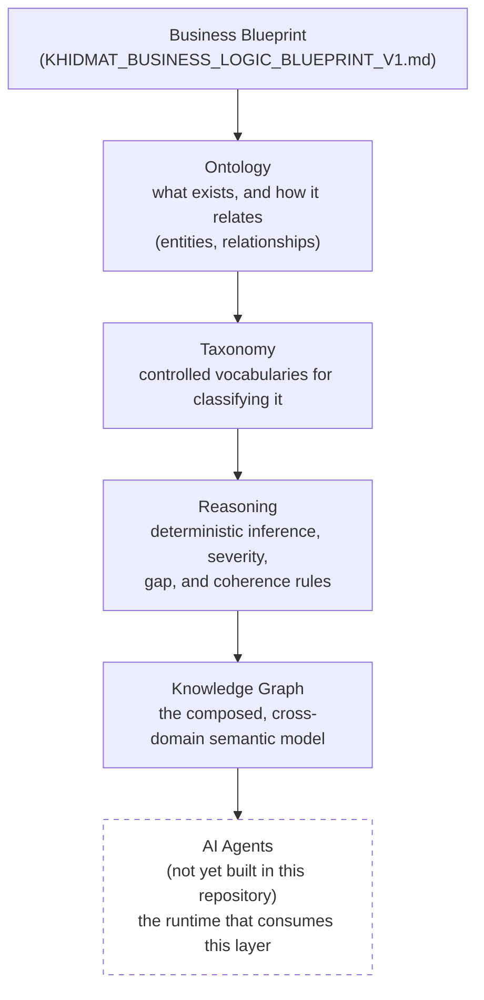
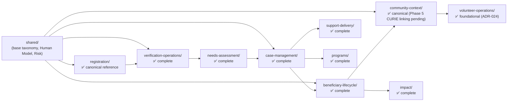

# Khidmat Knowledge Layer

## Vision

Khidmat AI is not a registration system. It is a **Humanitarian Operating System** —
software designed to understand people, families, households, communities,
vulnerabilities, capabilities, risks, and support pathways so that assistance can be
delivered accurately, fairly, proactively, and at scale.

Most systems answer *"what did this person ask for?"*. Khidmat is designed to answer
*"what does this person need, why do they need it, what happens if the need goes
unmet, who else is affected, and what support pathway exists?"* — including needs
that are implied, emerging, or likely to occur in the future, before the beneficiary
has to ask.

See [`KHIDMAT_BUSINESS_LOGIC_BLUEPRINT_V1.md`](KHIDMAT_BUSINESS_LOGIC_BLUEPRINT_V1.md)
for the full statement of that vision.

This repository is the **canonical humanitarian knowledge layer** underneath that
vision. It is not application code, and it does not implement runtime behaviour. It
is the ontology, taxonomy, reasoning, and governance substrate that every future
Khidmat AI agent, service, or reasoning engine is expected to be built on top of.

---

## Quick Start

New to this repository? Do these four things, in order, before reading anything else:

1. **Read this README fully** (10 minutes) — vision, status, structure, architecture.
2. **Skim [`ARCHITECTURE.md`](ARCHITECTURE.md)** — the current Domain Inventory table
   tells you exactly which domains are safe to treat as stable references and which
   are placeholders or in-migration.
3. **Pick one domain folder that matches what you're working on** and read its
   `README.md` — every domain directory has one, with Purpose / Scope / Owns / Does
   Not Own / Directory Structure / Related Documents in the same shape.
4. **Review `catalog.yaml`** at the repository root — this is the canonical machine-readable repository manifest, defining namespaces, module paths, and the dependency graph.
5. **Before touching any ontology or taxonomy file**, read
   [`docs/architecture/Canonical_Ontology_Schema.md`](docs/architecture/Canonical_Ontology_Schema.md)
   or [`Canonical_Taxonomy_Schema.md`](docs/architecture/Canonical_Taxonomy_Schema.md)
   (whichever applies) and [`AI_WORKFLOW.md`](AI_WORKFLOW.md) — this repository is
   governed, and undeclared concepts or off-contract file shapes will be rejected in
   review.

**This repository contains no executable code.** There is nothing to install, build,
or run — every file is either Markdown (documentation/governance) or YAML
(ontology/taxonomy/reasoning declarations) meant to be *read*, by humans and,
eventually, by a reasoning engine that does not yet exist in this repository.

## Reading Order for First-Time Reviewers

| Order | Document | Why |
|---|---|---|
| 1 | [`README.md`](README.md) (this file) | Orientation: vision, status, structure |
| 2 | [`KHIDMAT_BUSINESS_LOGIC_BLUEPRINT_V1.md`](KHIDMAT_BUSINESS_LOGIC_BLUEPRINT_V1.md) | The business vision everything else serves |
| 3 | [`ARCHITECTURE.md`](ARCHITECTURE.md) | Domain inventory, maturity levels, dependency rules |
| 4 | [`GLOSSARY.md`](GLOSSARY.md) | Ubiquitous language — skim once, reference often |
| 5 | A domain `README.md` matching your task | Purpose/Scope/Owns/Does-Not-Own for that domain |
| 6 | [`docs/architecture/Canonical_Ontology_Schema.md`](docs/architecture/Canonical_Ontology_Schema.md) + [`Canonical_Taxonomy_Schema.md`](docs/architecture/Canonical_Taxonomy_Schema.md) + [`Repository_Migration_Methodology.md`](docs/architecture/Repository_Migration_Methodology.md) | The frozen file-shape contracts and the process for migrating a domain onto them, before editing any YAML |
| 7 | [`architecture-decisions/README.md`](architecture-decisions/README.md) | The ADR index — the "why" behind every non-obvious decision |
| 8 | [`AI_WORKFLOW.md`](AI_WORKFLOW.md) | Governance process and roles, before proposing a change |

If you only have 10 minutes: stop after step 3. That's enough to understand the
vision, the current maturity of every domain, and where your task's domain sits.

---

## Repository Purpose

This repository defines, for the humanitarian domain Khidmat operates in:

- **Ontology** — the entities, relationships, and structural constraints that
  describe what exists (a Beneficiary, a Household, a Need, a Risk, a Verification
  Activity, and how they relate).
- **Taxonomy** — the controlled vocabularies used to classify those entities (need
  categories, situation triggers, risk hazard categories, verification outcomes).
- **Reasoning** — deterministic, human-readable inference, severity, gap-detection,
  and coherence rules that describe how the AI should reason over the ontology.
- **Questioning** — the conversational strategy and question templates an AI
  registration agent uses to fill knowledge gaps responsibly.
- **Readiness** — the conditions under which a case is considered complete enough
  to progress (e.g. to verification).
- **Verification** — how claims made during registration are confirmed in the
  field, and how that evidence feeds back into the knowledge model.
- **Governance** — how ownership, authority, and change control are enforced across
  every domain, so that the knowledge graph stays internally consistent as it grows.

Everything here is intentionally declarative. It is designed to be consumed by an
AI reasoning layer (not yet built in this repository — see
[Architecture](#architecture)) rather than to execute anything itself.

---

## Current Status

| Layer | Status |
|---|---|
| Repository Architecture (canonical file/module contract) | ✅ Frozen — `docs/architecture/Canonical_Ontology_Schema.md` and `Canonical_Taxonomy_Schema.md` |
| Canonical Ontology Structure | ✅ Stable — ratified 5-file `ontology/` module shape (`entities`, `data-properties`, `relationships`, `semantic-constraints`, `lifecycle-constraints`) |
| Canonical Taxonomy Structure | ✅ Stable — ratified `schemes:` → `concepts:` module shape |
| Registration Domain | ✅ Canonical Reference Implementation — first domain migrated to the canonical structure (Phases 1–4 complete; Phase 5 cross-domain CURIE linking blocked on a repository-wide manifest) |
| Shared Domain (base taxonomy, Human Model, Risk) | ✅ Stable |
| Needs Assessment, Case Management, Beneficiary Lifecycle Domains | ✅ Complete (Level 1) |
| Verification Operations Domain | ✅ Core ontology and reasoning complete |
| Community Context Domain | ✅ Canonical (Phases 1–4 complete; Phase 5 cross-domain CURIE linking blocked on a repository-wide manifest) |
| Support Delivery, Programs, Impact Domains | ✅ Complete (Level 1) |
| Volunteer Operations Domain | ✅ Foundational (Tier 1) complete per ADR-024 — operational/runtime layer deferred to Stage 9 |
| Donor & Resource Domain | ✅ Complete — identity, grants, and resource classification |
| Consent & Privacy | 🚧 Level 2 placeholder — scope declared, not yet active |

For the authoritative, continuously-updated view of what is done, in progress, and
missing, see `catalog.yaml` and `knowledge_layer_roadmap.md` —
this table is a snapshot for orientation, not the source of truth.

---

## Repository Structure

```
khidmat-knowledge/
├── shared/                    # Cross-domain foundation: base taxonomy, Human Model, Risk
├── registration/              # Intake conversation domain — the canonical reference implementation
├── community-context/         # Geographic, environmental, and social context of a household
├── verification-operations/   # Field verification of claims made during registration
├── needs-assessment/          # Synthesizes claims + verified facts into identified needs
├── case-management/           # Case orchestration: plans, referrals, follow-ups, assignments
├── beneficiary-lifecycle/     # Macro-state tracking of a beneficiary's engagement over time
├── support-delivery/          # How an approved intervention is actually delivered
├── programs/                  # Structured, multi-case programmatic assistance
├── impact/                    # Longitudinal outcome and impact measurement
├── volunteer-operations/      # Volunteer profile, capacity, and dispatch (foundational layer)
├── consent-and-privacy/       # (placeholder) Consent, minimal today, required by Case Management
├── donor-resource/            # Donor identity, grant tracking, and resource classification
├── architecture-decisions/    # ADR-001 … ADR-028 — the authoritative decision log
└── docs/architecture/         # Canonical schema contracts and migration methodology
```

**shared/** — The single-ownership home for concepts used by two or more domains:
person/organisation/location/document/time vocabulary, the Shared Human Model
(lifecycle stages, capabilities, dependency, family structure, health conditions),
and the Risk Domain (hazard, exposure, vulnerability, household resilience, risk
composition). Per ADR-008, nothing here may be redefined elsewhere.

**registration/** — Models a single intake conversation end-to-end: actors, needs,
situations, claims, evidence, support interventions, gap detection, severity
classification, case coherence, questioning strategy, and readiness-for-verification
rules. This is the most mature domain and the first one migrated to the canonical
`ontology/`+`taxonomy/` structure — treat it as the reference pattern for future
domain migrations.

**community-context/** — Models the geographic, infrastructural, environmental, and
social fabric a household sits inside (settlement type, accessibility, hazards,
seasonal events, local organisations). Canonical migration Phases 1–4 complete; Phase 5
cross-domain CURIE linking remains blocked on a repository-wide manifest.

**verification-operations/** — Produces verification knowledge (field observations,
findings, confidence, escalation, reverification triggers) from activities performed
against registration outputs.

**needs-assessment/** — A synthesis layer: turns registration claims and
verification findings into `IdentifiedNeed`s with explicit confidence, decoupled
from case orchestration.

**case-management/**, **beneficiary-lifecycle/** — Orchestration and longitudinal
tracking once a case exists: case plans, referrals, follow-ups, and the
macro-lifecycle (lead → registration → verification → beneficiary → support →
outcome) a person moves through over time.

**support-delivery/**, **programs/**, **impact/** — Canonical `ontology/`+`taxonomy/`
structure complete.

**volunteer-operations/** — Foundational (Tier 1) canonical `ontology/`+`taxonomy/`
structure complete per ADR-024; the operational/runtime layer (scheduling, dispatch,
trust/performance scoring) remains deferred to the Stage 9 activation trigger.

**donor-resource/** — Donor identity, grant tracking, and resource classification models
(fully authored per ADR-025 through ADR-028).

**consent-and-privacy/** — Declared Level 2 placeholder (ADR-004). Has a scope
statement and an explicit concept-ownership boundary, but no taxonomy or ontology
content is authored until the domain is activated per `knowledge_layer_roadmap.md`.

### Folder Purpose Table

Every domain follows a similar internal shape. This is what each subfolder means,
wherever you see it (not every domain has every subfolder):

| Folder | Purpose |
|---|---|
| `ontology/` | Entities, relationships, and structural constraints — what exists and how it connects |
| `taxonomy/` | Controlled vocabularies used to classify entities (categories, statuses, types) |
| `reasoning/` | Deterministic inference, severity, gap-detection, and coherence rules — consumes ontology/taxonomy, defines no concepts of its own |
| `questioning/` | Conversational strategy and question templates for an AI-driven registration interview |
| `readiness/` | Conditions under which a case is considered complete enough to progress |
| `verification/` | Definitions of derived/projected artifacts (e.g. the Verification Brief) — not stored entities |
| `gaps/` | Vocabulary of information-gap types and their severity |
| `docs/architecture/` | Repository-wide structural contracts and migration methodology (not domain-specific) |
| `architecture-decisions/` | The ADR log — one immutable record per significant design decision |

**Important:** `reasoning/*.yaml` files are declarative rule descriptions, not
executable code — there is no rules engine in this repository that runs them
today. They exist to be *read and later implemented* by a runtime layer that has
not yet been built (see [Architecture](#architecture)).

---

## Architecture

The knowledge layer is built in dependency order, from business reality down to a
form an AI agent can reason over:



*(Note: this repository stops at the Knowledge Graph layer — the "AI Agents" box is
shown only to complete the picture and does not exist here yet; see the note below.)*

### Domain Dependency Order

Domains activate in the order `knowledge_layer_roadmap.md` defines — a domain does
not activate until the domains it depends on are substantially complete
(ADR-009). This is the current state, not a plan for a single future release:



Every domain's `ontology/` module follows one fixed, frozen file contract —
`entities.yaml`, `data-properties.yaml`, `relationships.yaml`,
`semantic-constraints.yaml`, `lifecycle-constraints.yaml` — and every `taxonomy/`
module follows one fixed `schemes:` → `concepts:` contract. Concept ownership is
single-sourced (ADR-008): a concept is referenced by many domains but defined in
exactly one. Cross-domain dependencies must form a Directed Acyclic Graph — no
domain may create a circular reference to another.

**This repository stops at the knowledge layer.** It defines what an AI agent
should know and how it should reason; it does not yet define the runtime,
orchestration, or working-memory layer that would execute that reasoning against a
live case. That is deliberately out of scope here (see `AI_WORKFLOW.md`'s
architectural principle) and is expected to be designed against this layer once it
is stable.

---

## Documentation Guide

This repository's single canonical onboarding path is the
[Reading Order for First-Time Reviewers](#reading-order-for-first-time-reviewers)
table above — start there rather than re-deriving a reading order from any other
document. `ARCHITECTURE.md`
intentionally points back to that table instead of maintaining its own.

Beyond that reading path:

- For day-to-day governance mechanics — who owns what, how a change is proposed and
  reviewed, and what must never be done — see [`AI_WORKFLOW.md`](AI_WORKFLOW.md).
- For what exists and what's missing, see `catalog.yaml` (the repository manifest),
  `ontology_authority_matrix.md`, and `knowledge_layer_roadmap.md`.
- The ADR log (`architecture-decisions/`, ADR-001 through ADR-029) records every
  significant design decision and its rationale; `architecture-decisions/README.md`
  has a full index.

---

## Current Roadmap

Registration is the completed reference implementation for the canonical
architecture. The Shared Human Model, Risk Domain, Verification Operations, Needs
Assessment, Case Management, Beneficiary Lifecycle, Community Context, Support
Delivery, Programs, and Impact domains are substantively complete; Volunteer
Operations has its foundational (Tier 1) layer complete. Remaining work is closing
the small number of genuine content gaps recorded in each domain's own migration
plan (e.g. registration's support-intervention taxonomy, which depends on an
operational intervention catalogue from programme staff; Community Context's Phase 5
cross-domain CURIE linking, blocked on a repository-wide manifest), and then
activating the remaining Consent & Privacy placeholder and Volunteer Operations'
operational layer in the dependency order `knowledge_layer_roadmap.md` defines.
Internal migration task lists live in `docs/architecture/` and the domain-specific
migration plans, not here.

---

## Design Principles

- **Single ownership of concepts** (ADR-008) — every concept has exactly one
  authoritative owner, declared in `ontology_authority_matrix.md`. Every other
  file references it; none redefine it.
- **Separation of ontology and taxonomy** — entities/relationships (what exists,
  how it connects) are governed independently from controlled vocabularies (how
  values are classified), each with its own frozen schema contract.
- **Domain-driven knowledge organization** — each bounded context (registration,
  risk, verification, etc.) owns its own concepts and activates only once its
  prerequisites are substantially complete (ADR-009), preventing premature
  invention and ontology drift.
- **Reasoning separated from knowledge** — `reasoning/` rules consume the ontology
  and taxonomy but never define concepts of their own; a reasoning-produced
  finding (a gap, a flag, a score) is never modeled as an ontology entity (ADR-023,
  `Canonical_Ontology_Schema.md` §19).
- **Multi-agent readiness** — concept boundaries, the acyclic cross-domain
  dependency rule, and the frozen file contracts exist so that multiple AI systems
  (design, audit, implementation) and, eventually, multiple reasoning agents, can
  operate over the same knowledge graph without producing conflicting or
  duplicate definitions.
