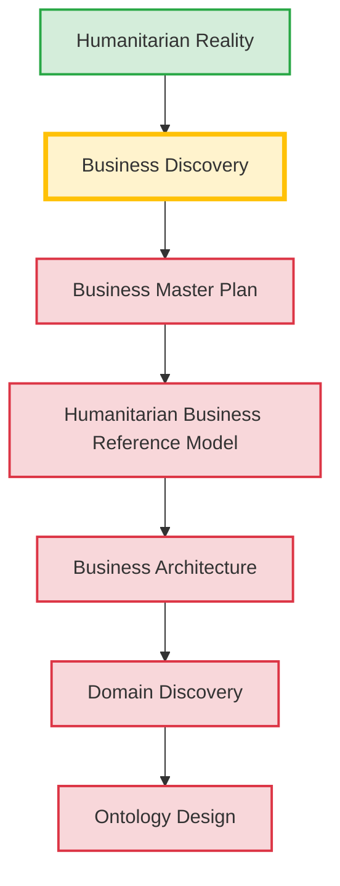

# Project Status Dashboard

## 1. Project Overview
The Khidmat Knowledge Repository is the canonical source of truth for the Khidmat AI project's humanitarian knowledge, business models, and architecture. Its purpose is to establish a trustworthy, evidence-based understanding of humanitarian reality before any technical automation or software is built. 

The repository operates on a strict **phased methodology**. Phases are intentionally sequential; work in downstream phases (such as architecture or taxonomy) is strictly prohibited until the prerequisite upstream phases (like discovery) are fully complete and their governance gates are cleared.

---

## 2. Project End Goal

The ultimate objective of this repository is NOT Business Discovery. The ultimate objective is the successful design of the **Khidmat Humanitarian Ontology**.

Business Discovery exists solely as preparation. The repository is intentionally moving slowly through methodology and governance gates because ontology design must be grounded in validated humanitarian business reality, not assumptions. Ontology engineering was intentionally postponed until this reality is rigorously discovered. Every current phase—Business Discovery, the Business Master Plan, the Humanitarian Business Reference Model, Business Architecture, and Domain Discovery—exists only to provide validated inputs into Ontology Design.

---

## 3. Current Strategic Objective

The immediate deliverable of this repository is to produce a complete **Ontology Design** for ONLY the following two sections:

1. **Domain Primitives**
2. **Ontology Layers**

The repository will STOP after these two sections are designed. No further ontology work will continue until explicit approval is received from the Project Lead.

---

## 4. Planned Lead Review

The first review package delivered to the Project Lead will contain ONLY:

- ✓ Domain Primitives
- ✓ Ontology Layers
  - Facets
  - Entities
  - Relationships
  - Constraints
  - States
  - Events
  - Cognition
  - Coordination Patterns

This is an intentional architectural checkpoint. Only after approval will work continue on downstream ontology elements: Pillars, Architecture Rules, Ground Truth Reviews, Evidence Framework, and Governance Framework.

---

## 5. Overall Project Status

| Phase | Status | Brief Description |
|---|---|---|
| Repository Foundation | **Complete** | Governance Baseline v1.0 established. All core governance documents frozen and authoritative. |
| Business Discovery Methodology | **Complete** | `BUSINESS_DISCOVERY_BLUEPRINT.md` established and approved. |
| Business Discovery | **Complete** | Evidence successfully gathered. Business Discovery is formally closed. |
| Business Master Plan | **Complete (Frozen)** | Stage 2 completed. Canonical strategy defined. |
| Humanitarian Business Reference Model | **Complete (Frozen)** | Stage 3 completed. Universal humanitarian reality modeled. |
| Business Architecture | **Complete (Frozen)** | Stage 4 completed. Business domains and boundaries formally established. |
| Domain Discovery | **Active** | Upstream phases complete. Ready to begin per-domain mapping. |
| Ontology Design | **Blocked** | Downstream phase. Cannot begin until domains are discovered. |
| Taxonomy Engineering | **Blocked** | Downstream phase. Cannot begin until ontology is designed. |
| Systems Engineering | **Not Started** | Out of scope for current knowledge repository work. |

---

## 6. Current Active Phase

- **Current Phase:** Domain Discovery (Stage 5)
- **Objective:** To map specific domains against the Business Architecture, qualifying actors, concepts, and evidence.
- **Why this phase is active:** Stages 1-4 are frozen. The core structural framework is established and ready for domain-specific practitioner evidence.
- **Blocked Downstream Phases:** Ontology Design, Taxonomy Engineering, and Systems Engineering remain blocked until Domain Discovery produces qualified concepts.

---

## 7. Discovery Progress

| Topic | Status | Brief Description |
|---|---|---|
| **TD-01** — Humanitarian Ecosystem & Actor Types | Handed off | Discovered the core humanitarian ecosystem actors, categorizing them by mandate (UN, NGO, Government, Community) and role (Donor, Implementer, Coordinator). |
| **TD-02** — Stakeholder Interests & Tensions | Handed off | Highlighted the fundamental tension between operational accountability (donor/agency focus) and beneficiary agency and dignity. |
| **TD-03** — Humanitarian Lifecycle (Business View) | Handed off | Differentiated the individual beneficiary case lifecycle (non-linear) from the organizational programmatic response cycle. |
| **TD-04** — Business Capabilities | Handed off | Confirmed MEAL and CFM as distinct standard capabilities and exposed the recurring altitude gap between organizational functions and case functions. |
| **TD-05** — Business Services & Value Streams | Handed off | Identified that value streams split between material and information flows, and operate differently at programme versus case altitudes. |
| **TD-06** — Intervention Categories | Handed off | Established that interventions are categorized across three intersecting dimensions (Sector, Modality, Temporal phase) rather than a single flat taxonomy. |

---

## 8. Governance Status

| Artifact | Status | Purpose |
|---|---|---|
| **Khidmat Foundation Roadmap** | Active | Tracks the components required to complete the Foundation before Ontology Design can begin. |
| **Assumption Register** | Active (10 entries) | Tracks necessary assumptions made due to the structural absence of Tier A practitioner evidence. |
| **Contradiction Log** | Active (2 entries) | Logs conflicts between internal documents or external evidence that require Human Owner resolution. |
| **Discovery Phase Review 01** | Complete | Assessed process health, methodological compliance, and evidence gaps after TD-03. |
| **Governance Baseline v1.0** | Complete | Replaces 'Governance Freeze'. Asserts that the Governance layer is now complete, stable, and capable of governing Ontology Design. |
| **Decision Ledger** | Active | Established 2026-07-29 under remediation B10, per Constitution Articles XVII and XIX. Holds ADRs, Authority decisions and Package approvals. 6 ADRs open; 1 decision ratified; 1 approval pending. |
| **Stage 5 Business Discovery Certification** | **VOID** | Voided 2026-07-29 by ratified decision GOV-001 (skipped gate, Article XVI; contradicted by `VALIDATION/CERTIFICATION.md`). The standing state of the cross-domain layer is **NOT CERTIFIED**. |
| **Foundation Readiness Assessment** | Accepted as baseline | Independent review, 2026-07-29. Accepted as the approved remediation backlog. Decision: FOUNDATION INCOMPLETE. |
| **Remediation Log** | Complete for this phase | `REMEDIATION_LOG_2026-07-29.md`. Traces every repository modification to an accepted finding. |

---

## 9. Outstanding Human Owner Decisions

| ID | Status | Brief Description | Impact |
|---|---|---|---|
| **CL-001** | Resolved | Programme and Organisation are confirmed as distinct concepts. | Unblocks downstream capability mapping. |
| **CL-002** | Resolved | Donor is a valid actor; exclusion is strictly V1 software scope. | Unblocks actor definitions. |
| **ADR-001** | **Open** | Khidmat's operating scope — understanding versus delivery. | **Load-bearing.** The Article IV admission test cannot be applied consistently until settled. |
| **ADR-002 – ADR-006** | **Open** | Location ownership; consent propagation; evidence grading; MEAL snapshots; deduplication minimum disclosure. | Carried into the ledger from cross-domain documents where they had been recorded as notes. |
| **GOV-002** | **Open** | Package A (Khidmat Foundation) approval by the Domain Approval Authority. | Constitution Article XVI makes this a precondition for Ontology Design. Cannot be granted by an execution phase. |
| **Ground truth channel** | **Open** | Tier A practitioner access (remediation B13). | Executed zero times across 6 dossiers and 10 domains. No Ground Truth Review can pass without it; every universal Constraint tag remains untested. |

---

## 10. Recent Milestones

- Business Discovery methodology successfully deployed and validated.
- **Discovery Phase Review 01** completed, confirming process hygiene.
- **TD-01 through TD-06** successfully researched and handed off.
- **Governance Baseline v1.0** established, completing the constitutional layer (Domain Approval and Audit Authorities).
- Redundant governance documents (`PRINCIPLES.md`, `PHILOSOPHY.md`) formally deprecated and removed to strengthen canonical authority.
- `FOUNDATION.md` ratified as the intellectual foundation of the project.
- `GLOSSARY.md` synchronized and upgraded to v1.0 Normative.

---

## 11. Upcoming Milestones

- **Business Master Plan (Stage 2)** authored and formally frozen.
- **Humanitarian Business Reference Model (Stage 3)** authored and formally frozen.
- **Business Architecture (Stage 4)** authored and formally frozen.
- **Domain Discovery (Stage 5)** unblocked.

---

## 11. Upcoming Milestones

- Executing Stage 5 Domain Discovery for priority domains (e.g., Case Management).
- **Ultimate Goal:** Delivery of Package A (Khidmat Foundation) and Package B (Ontology Design Foundation) for Lead Review.

---

## 12. Repository Statistics

- **Discovery Topics Completed:** 6
- **Open Contradictions:** 2
- **Active Assumptions:** 14
- **Discovery Reviews:** 1
- **Decision Briefs:** 1
- **Current Active Phase:** Domain Discovery

---

## 13. Phase Dependency Diagram

---

## 14. Notes

- **Domain Discovery is currently active.**
- **Downstream artifacts must not begin until prerequisite phases complete.**
- **This document should be updated whenever a major project milestone is reached.**
