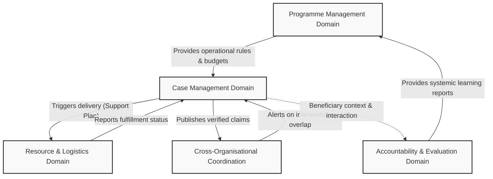

# Khidmat AI Business Architecture

## 1. Introduction
This document defines the formal Business Architecture for Khidmat AI, translating the principles and structures of the Humanitarian Business Reference Model (Stage 3) into distinct, governable business domains. It maps the responsibilities, boundaries, shared concepts, and cross-domain interactions necessary to execute the humanitarian cognitive lifecycle without relying on specific software or database implementations.

## 2. Major Business Domains

### 2.1 Case Management Domain
**Responsibility:** Governs the individual and household lifecycle. It is responsible for screening, context and needs assessment, support planning (eligibility and matching), and ongoing case monitoring for specific individuals.
**Boundaries:** 
- *In Scope:* Individual identity verification, household vulnerability assessment, case-level planning, case closure.
- *Out of Scope:* Aggregated regional needs assessment, securing funding, physical procurement of aid.

### 2.2 Programme Management Domain
**Responsibility:** Governs the macro-level coordination, resourcing, and strategic boundaries of humanitarian assistance. It establishes the capacity, budget, and operational rules (intervention catalogues, target populations) that case workers execute.
**Boundaries:**
- *In Scope:* Resource mobilization, budget allocation, defining eligibility rules, macro-level response planning.
- *Out of Scope:* Individual case assessment, direct delivery of assistance.

### 2.3 Resource and Logistics Domain (Material Flow)
**Responsibility:** Manages the physical and financial execution of assistance. It translates the "knowledge" of an approved support plan into the tangible delivery of goods, services, or Cash and Voucher Assistance (CVA).
**Boundaries:**
- *In Scope:* Procurement, supply chain management, vendor/market actor coordination, financial disbursements.
- *Out of Scope:* Deciding who is eligible for assistance (handled by Case Management) and overall budget setting (handled by Programme Management).

### 2.4 Accountability and Evaluation Domain
**Responsibility:** Provides systemic oversight, ensuring operations meet ethical standards and achieve intended human development outcomes. It operates independently of the active case lifecycle to prevent conflicts of interest.
**Boundaries:**
- *In Scope:* Monitoring, Evaluation, Accountability, and Learning (MEAL), independent Complaints and Feedback Mechanisms (CFM), long-term impact assessment.
- *Out of Scope:* Active case interventions, immediate crisis response, determining individual eligibility.

### 2.5 Cross-Organisational Coordination Domain
**Responsibility:** Facilitates the sharing of verified evidence and operational context across different humanitarian actors to prevent duplication and ensure continuity of care.
**Boundaries:**
- *In Scope:* Deduplication of interventions, secure sharing of verified claims, inter-agency referrals.
- *Out of Scope:* Internal Organisational management, unilateral alteration of another Organisation's assessment.

## 3. Shared Business Concepts
To function as a cohesive ecosystem, the domains rely on shared, canonical business concepts that must retain consistent identity across boundaries:

- **The Affected Person / Household:** The primary subject of humanitarian action. 
  - *Case Management* interacts with them as an active participant.
  - *Programme Management* views them as an aggregated demographic.
  - *Accountability* views them as the source of feedback and outcome measurement.
- **The Intervention (Support Service):** The mechanism of assistance.
  - *Programme Management* defines the catalogue and budgets it.
  - *Case Management* prescribes it to an individual.
  - *Resource and Logistics* physically procures and delivers it.
- **The Verified Claim (Evidence):** The atomic unit of truth.
  - *Case Management* generates and relies on it to justify decisions.
  - *Coordination* shares it to prevent duplicate assessments.
  - *Accountability* audits it to ensure compliance with the "Threshold for Human Review."
- **The Organisation (Actor):** The implementing body.
  - *Programme Management* allocates funds to it.
  - *Coordination* negotiates boundaries with it.

## 4. Cross-Domain Interactions
The domains do not operate in silos; their interactions form the core humanitarian value streams:

- **Programme to Case (Resource Constraint):** Programme Management passes approved operational rules, budgets, and intervention catalogues to Case Management. Case Management cannot prescribe an intervention that Programme Management has not resourced.
- **Case to Resource (Execution Trigger):** Upon human approval of a Support Plan in the Case Management domain, an execution trigger is passed to the Resource and Logistics domain to deliver the physical or financial assistance.
- **Resource to Case (Fulfillment Loop):** Resource and Logistics reports successful delivery back to Case Management, triggering the Monitoring and Reassessment phase of the individual lifecycle.
- **Case to Coordination (Context Sharing):** As Case Management verifies identity and prescribes interventions, it publishes encrypted, privacy-preserving proof to the Coordination domain to alert other Organisations and prevent duplicate aid.
- **Accountability to Programme (Learning Loop):** The Accountability domain evaluates the long-term impact of closed cases and provides systemic learning reports to Programme Management, forcing an update to future intervention strategies.

## 5. Business Architecture Principles
The following principles govern how the humanitarian business domains are structured, interact, and maintain integrity. They are architectural rules of business, independent of software implementation:

1. **Single Capability Ownership:** A business capability is owned and governed by exactly one domain. Other domains may consume its services or trigger its execution, but they cannot replicate or override its core logic.
2. **Separation of Knowledge and Execution:** The domain responsible for assessing needs and determining eligibility (Case Management) must remain structurally distinct from the domain that physically delivers the goods or funds (Resource and Logistics).
3. **Altitude Independence:** Programme-level coordination and case-level lifecycles operate on independent temporal cycles. They are coupled only by explicit handoffs (e.g., budget constraints or aggregated reporting).
4. **Context over Control:** The Cross-Organisational Coordination domain operates by securely sharing verified context to enable independent, informed decision-making by autonomous actors. It does not exert centralized command-and-control over another Organisation's operations.
5. **Decoupled Accountability:** Accountability and learning capabilities (MEAL, CFM) must reside in a domain completely separate from active case management to preserve objective evaluation and prevent conflicts of interest.
6. **Immutable Shared Concepts:** Canonical concepts (e.g., the Affected Person, the Verified Claim) retain a unified, consistent identity regardless of which domain is currently interacting with them.

## 6. Capability Allocation
Every major business capability defined in the Humanitarian Business Reference Model is allocated to a primary owning domain.

| Business Capability | Primary Owning Domain | Rationale |
|---|---|---|
| **Evidence & Knowledge Acquisition** | Case Management Domain | Direct interaction with individuals to gather claims and context. |
| **Understanding Formation** | Case Management Domain | Synthesizing evidence to assess specific vulnerabilities. |
| **Reasoning & Justified Recommendation** | Case Management Domain | Matching assessed needs against programme rules to create a support plan. |
| **Verification** | Case Management Domain | Confirming accuracy of claims prior to justifying a recommendation. |
| **Continuity & Re-assessment** | Case Management Domain | Maintaining the ongoing relationship and looping the case lifecycle. |
| **Responsible Action (Delivery)** | Resource & Logistics Domain | Executing the physical or financial transfer of the approved intervention. |
| **Cross-Organisational Coordination** | Coordination Domain | Aligning interventions and deduplicating efforts across NGO boundaries. |
| **MEAL (Monitoring, Evaluation, Learning)** | Accountability Domain | Operating on a distinct cadence to evaluate macro-outcomes. |
| **Complaints & Feedback (CFM)** | Accountability Domain | Maintaining an independent channel for grievance resolution outside the case team. |

*(Note: While Programme Management utilizes macro-level equivalents of these capabilities (e.g., area-level Needs Assessment), the core cognitive sequence executed for individuals maps as above).*

## 7. Business Context Diagram
This diagram illustrates the primary structural relationships and the flow of shared concepts between the business domains.

