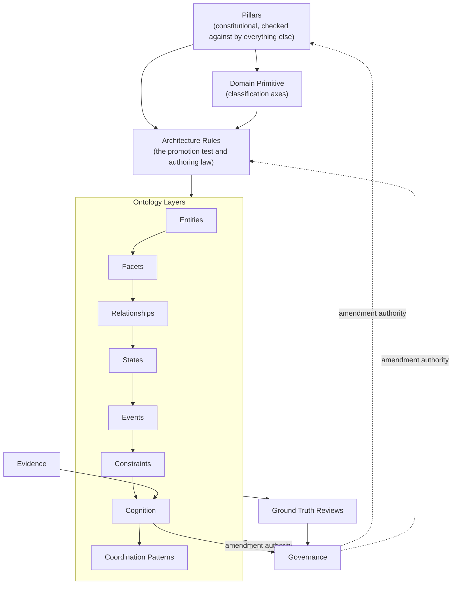

# ONTOLOGY DESIGN FRAMEWORK

**Type:** Framework document (Artifact A) — explains *how* ontology is designed. It is not the Humanitarian Ontology (Artifact B) and does not model humanitarian concepts.
**Relationship to `ONTOLOGY_DESIGN_BLUEPRINT.md`:** that document is the blueprint that governs this document's authoring — it reasoned through each of the seven sections below, recommended a position on eight genuine design forks, and explicitly deferred final ratification of those forks to the client. This document consolidates that reasoning into the canonical framework shape, under the required section structure, **without silently resolving any fork the Blueprint left open**. Where a fork remains open, it is marked as such below and listed again in §6.
**Status honesty:** this document exists in draft form so the framework's shape can be reviewed as a whole. It is not frozen, not certified, and must not be treated as authorizing any actual concept modeling — no Entity, Facet, Relationship, Constraint, State, Event, Cognition construct, Coordination Pattern, or taxonomy value appears anywhere below. Per the project's own architecture-readiness assessment, Ontology Design content-authoring itself cannot legitimately begin until the Business Master Plan and Humanitarian Business Reference Model exist — this Framework is the *method* that will govern that future authoring, prepared in advance, not an exemption from that sequencing.

---

## 1. Purpose of This Framework

Every future domain ontology within Khidmat — whatever humanitarian domain it eventually models — must be designed the same way, or the project inherits ontology engineering's most expensive failure mode: concepts shaped inconsistently by whoever happens to be modeling that week, discovered only once enough of them exist to collide. This Framework exists to fix, once, the *shape* every ontology must take and the *decisions* that must be made about any candidate concept before it is modeled — never the concepts themselves. Section 2 explains why the required progression is ordered the way it is; Section 3 designs each of the seven parts individually; Section 4 makes the true authoring dependency between them explicit; Section 5 states what "done" means for an ontology built under this Framework; Section 6 lists what remains genuinely undecided.

**Governing test for this document's own content, applied throughout:** could this statement be true of *any* competently designed humanitarian ontology, independent of which specific humanitarian domain or Khidmat implementation detail is eventually modeled? If yes, it belongs here. If it only makes sense with reference to a specific concept, domain, or engineering choice, it does not.

---

## 2. The Required Progression, and Why Its Presentation Order Differs From Its Authoring Order

The client's required structure is a **presentation** order — Domain Primitive, Ontology Layers (Facets, Entities, Relationships, Constraints, States, Events, Cognition, Coordination Patterns), Pillars, Architecture Rules, Ground Truth Reviews, Evidence, Governance — and this document follows it exactly as a table of contents. It is not, however, the order in which these seven parts can be correctly *authored*, because several later-listed parts structurally presuppose earlier ones. Section 4 makes this dependency explicit; each section below states its own position in both orders where they diverge.

One idea has to be stated before any section is designed individually, because it shapes all seven: **this framework must let the ontology represent not only humanitarian reality, but the system's own uncertainty about that reality.** A model of Household, Need, and Assistance alone would be an ordinary humanitarian data model. What this Framework exists to guarantee is that the resulting ontology can also represent what is claimed versus verified, how confident the system is entitled to be, where a human must decide instead, and how a universal rule differs from a locally-variable one. This is why Cognition, Ground Truth Reviews, and Evidence are required sections here, not optional extensions — they exist because the project's founding constraint is epistemic humility, not merely domain coverage.

---

## 3. Section-by-Section Framework Design

### 3.1 Domain Primitive

**Purpose.** The smallest, closed set of foundational categories that every later concept — every Entity, Facet, Relationship, Constraint, State, Event, Cognition construct, and Coordination Pattern — must be classifiable under. Domain Primitives are not concepts in the business-catalogue sense; they are the axes of classification that make every later decision decidable rather than ad hoc.

**Responsibilities.** Define a closed (or governance-controlled-extensible) list of abstract kinds of thing a humanitarian concept can be. Give every future author a first, decisive question to answer for any candidate concept: which primitive does this belong to?

**Inputs.** The Humanitarian Business Reference Model's stable, deduplicated concept catalogue — not to be copied forward as primitives themselves, but to be abstracted one level further: the primitives are the categories those concepts would need to be sorted into, including concepts the HBRM has not catalogued yet because no domain requiring them has activated.

**Outputs.** A ratified, named list of primitives; a stated rule on whether a concept may belong to more than one primitive at once; a stated rule on whether the list itself is closed or extensible, and under what governance tier an extension would require.

**Relationships to other sections.** The first gate every candidate concept passes through before entering any Layer (§3.2). Supplies the shared vocabulary the Architecture Rules promotion test (§3.4) is written in terms of. The anchor Ground Truth Reviews (§3.5) checks against when validating whether reality still fits the categories assumed at design time.

**Promotion criteria.** A candidate becomes a ratified Domain Primitive only if: it is genuinely abstract (not itself a business concept a downstream catalogue would define), it is exhaustive enough that no anticipated future concept is structurally homeless, and it is minimal (removing it would leave some class of concept unclassifiable, rather than merely inconvenient to classify).

**Review criteria.** Before ratification: can every currently-known stable business concept be classified under exactly one (or a stated, bounded set of) primitive without forcing an awkward fit? After ratification, at each Ground Truth Review: has any concept surfaced by real humanitarian practice failed to classify under any existing primitive?

**Common failure modes.** Re-declaring specific business nouns (Person, Household, Need) as if they were primitives themselves, rather than abstracting one level further — this duplicates the HBRM's own cataloguing job instead of solving the classification problem Domain Primitives exists to solve. Leaving the list open-ended with no governance tier, which lets primitives multiply the same way uncontrolled Entity subtypes would.

---

### 3.2 Ontology Layers

**Purpose of the Layers container as a whole.** Layers is where the actual modeling of concepts happens. The eight kinds of content it groups — Facets, Entities, Relationships, Constraints, States, Events, Cognition, Coordination Patterns — are structural peers (each is a *kind of thing* a concept can be), distinct from the classification axes above them (Domain Primitive) and the constitutional values and authoring law around them (Pillars, Architecture Rules).

**Authoring order versus presentation order (open fork — see §6, item 2).** The client's presentation order groups Facets before Entities. The recommended *authoring* order is **Entities → Facets → Relationships → States → Events → Constraints → Cognition → Coordination Patterns**, because several sub-layers structurally presuppose earlier ones (a Facet cannot be designed without first knowing what kind of thing it attaches to). This document presents the sub-layers in the client's required order below, and notes each one's authoring-order dependency inline.

#### 3.2.1 Facets

**Purpose.** Composable, independently-varying dimensions of an Entity (or, per an open fork, of a Relationship) — the qualifying detail that lets an Entity's situation be described in layers that can be added, revised, or retired independently, without minting a new Entity subtype for every new dimension recognized.

**Responsibilities.** Prevent uncontrolled Entity-subtype proliferation. Carry whatever confidence/provenance model Cognition (§3.2.7) and Evidence (§3.6) require, if the evidence-backed-assertion fork (§6, item 3) is ratified in the affirmative.

**Inputs.** An already-defined Entity (or Relationship) type to attach to (authoring dependency — Facets cannot be designed before Entities exist).

**Outputs.** A named Facet type; its value shape; its own lifecycle rules (added, revised, expired, superseded), stated independently of the Entity's own lifecycle.

**Relationships to other sections.** Depends on Entities (§3.2.2) existing first. Is the primary consumer of Evidence (§3.6). Is a primary object Cognition (§3.2.7) reasons about when estimating confidence.

**Promotion criteria.** A candidate becomes a Facet, not an Entity, when it has no independent identity or persistence apart from what it qualifies, and it varies independently enough from the Entity's core nature that folding it permanently into that Entity's definition would misrepresent it as fixed rather than revisable.

**Review criteria.** Does this Facet correctly avoid needing its own re-identifiable identity across time? Is its confidence/provenance treatment consistent with every other Facet's, per whatever the ratified position on fork §6.3 turns out to be?

**Common failure modes.** Modeling a genuinely re-identifiable, persistent thing as a Facet to avoid the overhead of a new Entity type. Treating a Facet as a bare, unqualified attribute when the project's epistemic-humility commitment requires it to carry confidence and provenance.

#### 3.2.2 Entities

**Purpose.** The things with independent identity that persist through time and that the rest of the ontology is *about* — re-identifiable across separate interactions, separate points in time, separate authors.

**Responsibilities.** Establish identity criteria (what makes two instances the same Entity versus two different ones) and each Entity's minimal always-true nature, independent of any Facet that may or may not currently be attached.

**Inputs.** Domain Primitive classification (§3.1) for each Entity type; the HBRM's concept catalogue as candidate material.

**Outputs.** A named Entity type; its identity criteria; its Domain Primitive classification.

**Relationships to other sections.** Authored first among the Layer sub-sections (authoring-order dependency) because Facets, Relationships, States, and Events all presuppose something to attach to, connect, or happen to. Coordination Patterns (§3.2.8) are patterns *of* Entities.

**Promotion criteria.** The central case the Architecture Rules promotion test (§3.4) must resolve: does the candidate have independent identity and persist through time in a way that must be re-identifiable later? If yes, Entity. If the candidate instead varies independently of some other thing without its own identity, it is more likely a Facet; if it connects two already-established things, a Relationship.

**Review criteria.** Can this Entity type's identity criteria actually distinguish two real instances in practice, not merely in the abstract? Does its minimal nature remain true independent of every currently-attached Facet?

**Common failure modes.** Entity-type proliferation — minting a new Entity for every recognized dimension of a situation instead of modeling most of that richness as Facets. The inverse failure — modeling something that genuinely needs independent, re-identifiable persistence (a specific Case, a specific Household) as a bare attribute of something else, losing the ability to track it consistently over time.

#### 3.2.3 Relationships

**Purpose.** Connections between two or more Entities.

**Responsibilities.** State which Entity types a Relationship type connects and in what direction (or whether symmetric); its temporal validity; its cardinality.

**Inputs.** The Entity types it connects must already be defined (authoring-order dependency).

**Outputs.** A named Relationship type; its connected Entity types and direction; its cardinality and temporal-validity rules; whether it carries its own Facets (per the same evidence-backed-assertion fork as §3.2.1).

**Relationships to other sections.** Depends on Entities. Is frequently the subject of Constraints (§3.2.4 — cardinality rules are usually rules about Relationships). Is a building block Coordination Patterns (§3.2.8) assemble into recognizable multi-Entity shapes.

**Promotion criteria.** A candidate becomes a Relationship, not an Entity, when its entire reason for existing is to connect two or more already-established things, and it has no independent identity apart from that connection.

**Review criteria.** Is the cardinality stated explicitly rather than assumed? Is the claim-versus-verified status of the Relationship itself represented consistently with how Facets represent it?

**Common failure modes.** Treating a Relationship as a bare structural link and pushing all qualifying detail onto the Entities at either end, losing the ability to say something is true of the *connection* rather than either party. Leaving cardinality implicit rather than stated.

#### 3.2.4 Constraints

**Purpose.** Rules that bound which configurations of Entities, Facets, Relationships, States, and Events are valid — cardinality facts, and the universal-versus-variable discipline that distinguishes a rule that holds in every deployment context from one that holds only in some, named explicitly rather than left implicit.

**Responsibilities.** Tag every Constraint as universal or variable, and, if variable, name the specific variation. Hold the *conditional*, business-rule-shaped rules — distinct from Pillars (§3.3), which hold the *unconditional* ones.

**Inputs.** The Entities, Facets, and Relationships it restricts must already have a shape (authoring-order dependency).

**Outputs.** A named Constraint; its universal/variable tag; if variable, its stated variation; which Entities/Facets/Relationships it governs.

**Relationships to other sections.** Depends on Entities, Facets, Relationships already being defined. Directly implements the universal/variable discipline Ground Truth Reviews (§3.5) later test against real contexts. Shares a boundary with Pillars (§3.3) that must be actively maintained, not assumed.

**Promotion criteria.** A candidate becomes a Constraint, not a Pillar, when it is conditionally true — true in this context, potentially different in another — rather than true by the ontology's own founding commitment, in every context, without exception.

**Review criteria.** Has every Constraint been explicitly tagged universal or variable, with none left implicitly assumed either way? Has a Constraint assumed universal ever actually been tested against a real, specific context (a direct Ground Truth Reviews responsibility)?

**Common failure modes.** Leaving a Constraint's universal/variable status implicit, which silently reintroduces exactly the untested-universal-claim risk this Framework exists to prevent. Misclassifying an unconditional Pillar-level commitment as an ordinary, overridable Constraint.

#### 3.2.5 States

**Purpose.** The enumerable condition an Entity occupies at a point in time — the stopping points a lifecycle passes through, catalogued as concepts, without reproducing the flow between them (that flow, as a recognized shape, belongs to Coordination Patterns, §3.2.8).

**Responsibilities.** Enumerate an Entity type's possible States. Decide, and state consistently, whether more than one State can be simultaneously true for different aspects of one Entity.

**Inputs.** The Entity type it describes must already be defined (authoring-order dependency).

**Outputs.** A named State; the Entity type (or Entity-granularity, e.g., a Need-within-a-Case rather than the Household as a whole) it applies to; its evidence/confidence treatment if the evidence-backed-assertion fork is ratified affirmatively.

**Relationships to other sections.** Depends on Entities. Must be authored before Events (§3.2.6), since an Event is most naturally defined as what causes a transition between States. Feeds directly into Coordination Patterns (§3.2.8), which recognize sequences of State change across multiple Entities.

**Promotion criteria.** A candidate becomes a State when it names a condition an Entity occupies at a point in time, rather than a permanent, defining fact about the Entity (which would instead belong at the Entity or Facet level) or an occurrence (which belongs to Events).

**Review criteria.** Is the State represented as a bare label, or as an evidence-backed, time-stamped assertion consistent with the ratified position on fork §6.3? Does the model correctly allow simultaneous States across different aspects of one Entity where real practice requires it, rather than forcing one global status?

**Common failure modes.** Modeling State as a single global status field when an Entity can genuinely occupy more than one State at once across different aspects of its situation. Treating a State as unconditionally true rather than as the system's current, revisable belief about the Entity's condition.

#### 3.2.6 Events

**Purpose.** Occurrences in time that cause, or are evidence for, a State transition.

**Responsibilities.** State what State transition(s) an Event type can trigger or evidence; what Entity or Relationship it is an occurrence of; whether and how it is retained as history.

**Inputs.** States (§3.2.5) must already be defined (authoring-order dependency), since an Event is defined partly in terms of what it does to a State.

**Outputs.** A named Event type; its triggered/evidenced State transitions; its retention rule; its correction/retraction procedure.

**Relationships to other sections.** Depends on States. Is a primary source for the Evidence layer (§3.6). Is the raw material Coordination Patterns (§3.2.8) recognize repeating sequences within.

**Promotion criteria.** A candidate becomes an Event, not a State, when it names something that happened at a point in time rather than a condition that persists across a span of time.

**Review criteria.** Is the Event's effect on State explicitly stated? Is the retention/correction rule for a later-disputed Event consistent with the project's immutable-history commitment (a correcting Event layered on top, not a silent overwrite)?

**Common failure modes.** Silently overwriting or deleting an Event record once it is found to be based on a false claim, rather than layering a superseding correction — this destroys exactly the auditable history the project's accountability commitments require. Treating something that is really an ongoing condition as a point-in-time Event.

#### 3.2.7 Cognition

**Purpose.** The ontological representation of the system's own epistemic state — what it currently believes, how confident it is entitled to be, what is claimed versus verified, what produced a given belief, and where a confidence threshold requires escalation to a human rather than autonomous action.

**Why this must be a Layer, not left to application code (stated once, centrally, because it is the least self-evident section in this Framework).** The founding constraint that automation may never proceed without adequate understanding is not enforceable as a design principle unless the ontology itself can represent a claim's confidence, source, and verification status as first-class, queryable, auditable facts. If confidence lives only in application code, the ontology cannot express "this claim has not yet reached the confidence required for autonomous action" as a fact about the modeled world, and the project's founding sequence (Knowledge → Understanding → Reasoning → Responsible Action) becomes an implementation convention rather than a structural guarantee.

**Responsibilities.** Represent a Claim (not yet, or not fully, verified) as distinct from a Fact (verified, reliable at a stated confidence). Attach a confidence/uncertainty representation to any Facet, Relationship, or State assertion. Represent an escalation threshold as an ontological fact, not only an application rule.

**Inputs.** Evidence (§3.6) is what Cognition is built from — Cognition cannot exist without Evidence behind it, though Evidence can exist before it produces a confident belief.

**Outputs.** A Claim/Fact distinction usable across every Layer; a confidence representation (numeric, qualitative tier, or both — an open fork, §6); an escalation-threshold representation.

**Relationships to other sections.** Consumes Evidence (§3.6) directly. Wraps or references Facets, Relationships, and States. Is the mechanism by which the Understanding-Before-Automation Pillar (§3.3) becomes checkable rather than aspirational.

**Promotion criteria.** Not applicable in the Entity/Facet/Relationship sense — Cognition is not a concept type candidates are sorted into; it is a cross-cutting wrapper or parallel structure (an open fork, §6) applied to assertions made in other Layers.

**Review criteria.** Can every autonomous action be traced to a stated Cognition-layer confidence that met its escalation threshold? Is the Claim/Fact distinction applied consistently, not selectively, across every Layer that makes assertions?

**Common failure modes.** Implementing confidence scoring purely in application code, leaving the ontology itself unable to express what the system is and isn't entitled to believe. Conflating Cognition with Evidence (see §3.6's failure modes — this exact collapse has already occurred once in this project's history, with "resilience" versus "capacity to cope").

#### 3.2.8 Coordination Patterns

**Purpose.** Recurring, recognized multi-Entity configurations — the ontological formalization of business-level value streams, one layer more formal, but explicitly not an executable workflow.

**A boundary that must be actively policed, not merely stated once.** This is the layer at greatest risk of drifting into a process/workflow specification, which the project's business-purity and no-premature-automation discipline forbids at this altitude. A Coordination Pattern describes a recognizable shape — which Entities, Relationships, States, and Events recur together, in what order, and what Constraints and Cognition-confidence thresholds apply — without specifying how a system executes or automates it.

**Responsibilities.** Name and formalize recurring multi-Entity shapes. State each pattern's required Cognition-layer confidence threshold, if any, before the pattern is considered complete.

**Inputs.** Every other Layer sub-section — Coordination Patterns are compositions of Entities, Facets, Relationships, States, Events, Constraints, and Cognition, and must be authored last for that reason (both in the client's presentation order and the recommended authoring order — the one place the two agree).

**Outputs.** A named Coordination Pattern; its constituent Entities/Relationships/States/Events; its Constraints and Cognition-confidence requirements.

**Relationships to other sections.** Depends on every other Layer sub-section. Is the eventual home for cross-organization coordination authority questions, once a downstream document addresses them.

**Promotion criteria.** A candidate becomes a Coordination Pattern when it names a recurring configuration across multiple Entities and their Relationships/States/Events — never a single Entity's own behavior, and never an execution or automation instruction.

**Review criteria.** Does the pattern description stop at "shape" and avoid specifying execution mechanics? Is its Cognition-confidence requirement explicit rather than assumed?

**Common failure modes.** Drifting into workflow or automation specification — the single most actively-risked failure mode in this entire Framework, requiring explicit review discipline at this section specifically, not only a general purity check.

---

### 3.3 Ontology Pillars

**Purpose.** The small number of non-negotiable, unconditional design commitments every Domain Primitive, Layer concept, Constraint, and Coordination Pattern must satisfy — the ontology's own constitution, categorically stronger than any single concept's business rule.

**Responsibilities.** State a short, closed list of unconditional commitments (candidates in substance, pending final ratification, include: human dignity and agency; verification before trust; understanding before automation; distributed, non-centralized authority; universal-variable honesty). Serve as the check every other section must pass, never the reverse.

**Inputs.** The project's Vision and stated philosophy — Pillars are derived from these, not invented independently.

**Outputs.** A ratified, closed Pillar list; a stated amendment procedure requiring the highest governance tier (§3.7); a stated procedure for handling a Layer concept that appears to violate a Pillar (recommended: escalated, never silently rejected, per the project's own "flag, don't guess" discipline).

**Relationships to other sections.** Every other section is checked against Pillars, never the reverse. Binds Domain Primitives (§3.1), every Layer sub-section (§3.2), Constraints specifically (sharing a boundary that must be actively maintained), and sets the floor Ground Truth Reviews (§3.5) must confirm the model still honors.

**Promotion criteria.** A candidate becomes a Pillar, not a Constraint, when removing it would not merely change the model's form but would mean the system was no longer the system the Vision describes — i.e., it is universal in the strongest sense, never legitimately overridable by context.

**Review criteria.** Does Governance (§3.7) actually enforce a materially higher amendment tier for a Pillar than for an ordinary Constraint? Has any Pillar quietly been treated as an ordinary, overridable Constraint in practice?

**Common failure modes.** Collapsing Pillars into ordinary Constraints, which lets a legitimate context-specific Constraint override accidentally weaken something that was never supposed to be overridable at all. Substituting a topic-based structural grouping (a navigational skeleton) for genuine, testable principle-based design law — an open fork, §6.

---

### 3.4 Architecture Rules

**Purpose.** The authoring discipline governing how Layer concepts themselves get built and kept consistent over time — not what the ontology says about humanitarian reality, but the law governing how anyone is permitted to add to or change what it says.

**Responsibilities.** Define and maintain the **promotion test** — a small, ordered, repeatable set of questions that lets two different authors reach the same classification for the same candidate concept (does it have independent identity and persist through time? if not, does it vary independently of the thing it qualifies? if not, is it a connection between two already-established things?). Define a global concept-identity/uniqueness rule (one canonical name and identifier per concept, across every Layer). Define change-control (an identifier is never silently reused or redefined; amendment, deprecation, and splitting each have a defined procedure). Define how a Constraint or Facet is tagged universal versus variable, and how a variable one records its specific variation.

**Inputs.** Domain Primitives (§3.1), as the classification vocabulary the promotion test is written in terms of. Every open design fork flagged elsewhere in this Framework as "requires confirmation" — Architecture Rules is where each, once resolved, becomes binding law rather than a standing recommendation.

**Outputs.** A ratified promotion test, pressure-tested against a sample of real HBRM concepts before being treated as final. A concept-identity/uniqueness rule. A change-control procedure. A universal/variable tagging mechanism.

**Relationships to other sections.** Directly operationalizes every "requires confirmation" flag from §3.2. Is checked against Pillars (§3.3) for every rule it establishes. Is the register Ground Truth Reviews (§3.5) and Governance (§3.7) both cite when evaluating a proposed change for consistency.

**Promotion criteria.** Not applicable in the concept-classification sense — Architecture Rules is itself the mechanism that supplies promotion criteria to every other section; its own content is ratified through Governance (§3.7) at an elevated tier, one below Pillars.

**Review criteria.** Does the promotion test, applied by two different authors to the same candidate concept, reliably produce the same classification? Has it been pressure-tested against genuinely ambiguous real cases, not only clear ones?

**Common failure modes.** Designing or finalizing the promotion test too late or too loosely — flagged in the governing Blueprint as the single highest-leverage unresolved mechanism in the entire Framework, since most other open forks ultimately cash out as edge cases this test must handle. Leaving the Entity/Facet decision boundary untested against real concepts before treating it as settled.

---

### 3.5 Ground Truth Reviews

**Purpose.** The recurring, formal discipline of checking whether the ontology's model of reality — its Primitives, its Layer concepts, its universal-versus-variable Constraint tags — still actually matches lived humanitarian practice, in specific, real contexts, on an ongoing basis rather than only at initial design time.

**Why this must not be a one-time gate.** An untested universal claim is a liability wearing the appearance of settled fact, and an ontology-level mistake of this kind is far more expensive to discover and correct once structurally encoded than the same mistake left as an unverified paragraph of prose upstream.

**Responsibilities.** Validate the model against real, specific contexts, on a defined recurring cadence plus explicit out-of-cycle triggers (e.g., activating a new region or humanitarian domain). Include both expert/field validation (does this match how implementing organizations and volunteers actually operate) and, wherever consent and context allow, direct validation with the people the ontology models (does this match how a household would describe its own reality) — treated as two distinct, both-required checks, not one review assumed to satisfy both.

**Inputs.** The ratified Domain Primitives (§3.1), Layer concepts (§3.2), and Constraint universal/variable tags (§3.2.4) — the things being checked. Real field and lived-experience evidence as the material checked against.

**Outputs.** A record of what has been tested against what, so an untested assumption remains visibly untested rather than silently assumed validated. A disposition for each failed review (a Constraint assumed universal that turns out not to hold becomes explicitly variable, gets corrected at the Primitive level, or escalates to Governance).

**Relationships to other sections.** Tests Domain Primitives (§3.1) and the universal/variable tagging in Constraints (§3.2.4) against real contexts. Findings escalate into Governance (§3.7). Is itself a Pillar-adjacent commitment — an ontology that never checks itself against reality would itself violate Understanding Before Automation, applied reflexively to the ontology's own claims.

**Promotion criteria.** Not applicable in the concept-classification sense — this section governs an ongoing validation activity, not a category concepts are sorted into.

**Review criteria.** When field evidence conflicts with the existing model, does the field evidence win and the model get corrected — never the reverse? Is every disposition actually recorded, so the review trail itself remains auditable?

**Common failure modes.** Treating Ground Truth Review as a one-time, pre-launch gate rather than a recurring discipline. Allowing the existing model to override contradicting field evidence because the model is already built — reality is not obligated to conform to a prior design.

---

### 3.6 Evidence

**Purpose.** The record of what was actually observed, submitted, reported, or verified, and by what means, and how that record attaches to any Facet, Relationship, State, or Event assertion made elsewhere in the ontology.

**Why Evidence is distinct from Cognition, stated explicitly because the boundary has already collapsed once in this project's history.** Evidence is the *input* — the raw material of what was observed or submitted, with its own provenance and chain of custody. Cognition (§3.2.7) is the *derived belief* built from that Evidence. Evidence can exist before it has produced a confident Cognition-layer belief; Cognition cannot exist without Evidence behind it. This is a Broader/Narrower relationship, not two names for one idea — collapsing them would obscure exactly the distinction between *what was said* and *what the system is entitled to believe* that the project's philosophy most needs preserved.

**Responsibilities.** Maintain a typology of evidence sources (self-report, third-party report, physical/documentary evidence, direct observation, cross-referenced corroboration) with their own inherent reliability characteristics, modeled honestly rather than assumed equal. Maintain a provenance/chain-of-custody representation. Maintain an evidence lifecycle (expiry, contestation, supersession, retraction) that never silently deletes a belief built on later-retracted evidence, but explicitly supersedes it.

**Inputs.** Events (§3.2.6) are a primary source of Evidence. Field observations, submitted documents, and testimony generally.

**Outputs.** A typed evidence-source hierarchy; a provenance representation; a lifecycle/retraction procedure; the connection point every Facet/Relationship/State assertion cites when it carries a confidence/provenance wrapper.

**Relationships to other sections.** Feeds Cognition (§3.2.7) directly. Is what Facets, Relationships, and States cite when carrying a confidence/provenance wrapper. Is the authoritative material Ground Truth Reviews (§3.5) check a model claim against.

**Promotion criteria.** Not applicable in the concept-classification sense — Evidence is a supporting layer every assertion-bearing Layer section cites, not a category candidate concepts are sorted into.

**Review criteria.** Is evidence-source type represented structurally, independent of any particular confidence calculation performed on it, so a confidence assignment remains auditable back to what kind of evidence produced it? Is a retracted piece of evidence's downstream effect on any Cognition-layer belief explicitly superseded rather than silently removed?

**Common failure modes.** Conflating Evidence and Cognition — the single most concretely-precedented risk in this Framework, given the project's own prior experience distinguishing "resilience" from "capacity to cope." Treating all evidence sources as equally reliable by default rather than modeling their reliability characteristics honestly.

---

### 3.7 Governance

**Purpose.** Who has the authority to propose, review, approve, amend, deprecate, or freeze any concept in any section above, and at what tier of scrutiny — a routine addition (a new Facet type) is not the same order of decision as amending a Pillar.

**Responsibilities.** Define a tiering of decision authority, recommended to mirror a distributed-authority logic already established one level down at the business-architecture level: a new Facet or State value within an already-established Entity type as narrow, frequent, low-blast-radius; adding a new Entity type or Coordination Pattern as broader, less frequent; amending a Domain Primitive, an Architecture Rule, or a Pillar as rare, high-blast-radius, requiring the broadest view of the design's coherence. Define an approval procedure at each tier, applying the project's existing review discipline (drafted, independently reviewed, resolved against findings, formally closed) explicitly to ontology concepts.

**Inputs.** Proposed changes at every tier. Escalations from Ground Truth Reviews (§3.5) findings and from Cognition-layer (§3.2.7) confidence gaps.

**Outputs.** A tiered approval procedure; a defined escalation path from Ground Truth Reviews and Cognition-layer flags into a governance action, so neither a failed reality-check nor a persistent uncertainty resolves itself informally.

**Relationships to other sections.** Governs changes to every other section. Receives escalations from Ground Truth Reviews (§3.5) and Cognition-layer confidence gaps (§3.2.7). Is where the Architecture Rules promotion test (§3.4) and the Pillars' protected status (§3.3) both become enforceable rather than aspirational.

**Promotion criteria.** Not applicable in the concept-classification sense — Governance is the authority structure that rules on other sections' promotions, not a category itself.

**Review criteria.** Is the same tiering applied consistently, or does a Layer sub-section warranting stricter scrutiny (Coordination Patterns, given proximity to eventual automation) actually receive it? Is amendment authority for a Pillar materially harder to invoke than for an ordinary Constraint, in practice and not only on paper?

**Common failure modes.** Governance drift — a Pillar treated, in practice, at the same amendment tier as an ordinary Constraint, collapsing a distinction that exists on paper but not in enforcement. Assigning concrete named authority to a role at this altitude, which is a decision this Framework must not make — it belongs to a downstream document with the operational context to make it responsibly.

---

## 4. Cross-Section Dependency Model

The seven required sections are not peers to be read and authored in the order presented; they form a layered dependency. The presentation order above exists for readability. The authoring and validation order is:

Pillars and Domain Primitive are decided first because every other section is checked against or classified under them. Architecture Rules operationalizes that check into a repeatable procedure before any Layer content is authored. Within Layers, Entities are authored first because Facets, Relationships, States, and Events each qualify, connect to, or happen to something that must already exist. Evidence feeds Cognition directly rather than being folded into it. Ground Truth Reviews is the ongoing check that closes the loop back to reality, and Governance is the only path by which anything upstream — including a Pillar — may ever be changed.

---

## 5. Definition of Done for This Framework

This Framework is ready to govern actual ontology-content authoring only when:

1. Every open fork listed in §6 has been explicitly ratified, amended, or overridden by the client — none left silently accepted by default.
2. The Layer authoring order (§4) is confirmed, distinct from and in addition to the client-facing presentation order retained above.
3. The Architecture Rules promotion test (§3.4) has been pressure-tested against a deliberately-chosen sample of real Humanitarian Business Reference Model concepts — which in turn requires the HBRM to exist.
4. No section above contains an ontology class, entity, relationship, taxonomy value, or engineering artifact — verified by the same purity-scan discipline already applied at the Business Master Plan and HBRM layers.
5. A reviewer with no prior exposure to this Framework can read it end-to-end and correctly state, for any candidate business concept, which section it would need to be classified under and why, without needing to guess at an undecided fork.
6. The Business Master Plan and Humanitarian Business Reference Model both exist, since this Framework's promotion test, Pillars, and Domain Primitive all require real concept material to be pressure-tested against before any of them can be considered more than a well-reasoned draft.

Item 6 is the binding constraint at this project's current stage: this Framework can be fully designed, as this document does, without the BMP or HBRM existing — it is method, not content. It cannot be *validated* or *finalized* without them.

---

## 6. Open Forks Requiring Client Ratification

Carried forward from the governing Blueprint's own §7, unresolved, exactly as flagged there. Each is a genuine design fork this Framework has reasoned about and recommended a position on, without treating any as silently settled:

1. **Domain Primitive: abstract meta-categories, or HBRM cross-cutting concepts promoted directly (§3.1).** Recommended: meta-categories, with HBRM concepts as first instances classified against them, not the primitives themselves.
2. **Layer authoring order versus client-presentation order (§3.2, §4).** Recommended: Entities → Facets → Relationships → States → Events → Constraints → Cognition → Coordination Patterns for authoring, retaining the client's original order for presentation.
3. **Whether Facets, Relationships, and States are bare attributes/labels or first-class, evidence-backed, time-stamped assertions (§3.2.1, §3.2.3, §3.2.5).** Recommended: first-class assertions throughout.
4. **Whether Cognition belongs in the ontology at all, versus being purely a reasoning-engine/software concern (§3.2.7).** Recommended: it belongs in the ontology, so Understanding-Before-Automation is structurally checkable, not merely implemented in application code.
5. **Pillars as principle-based design law versus topic-based structural groupings (§3.3).** Recommended: principle-based.
6. **Evidence versus Cognition as one layer or two (§3.6).** Recommended: two, in a Broader/Narrower relationship.
7. **Who participates in Ground Truth Reviews (§3.5).** Recommended: both expert/field validation and, wherever consent and context allow, direct validation with the people the ontology models.
8. **Governance tiering modeled on business-level distributed-authority logic (§3.7).** Recommended: yes, mapping routine/new-type/Primitive-or-Pillar decisions onto low/medium/high governance tiers respectively.

None of these are resolved by this document. Each requires explicit client decision before this Framework can move from Draft to a status that could govern actual ontology-content authoring.
